# Week 1: Linux fundamentals and terminal Confidence

**Goal:** The main goal of the week is be confortable with the linux and terminal interface because most servers, docker, containers, Kubernetes nodes, cloud VMs, and devops automation and environment run on linux. No need to  Memorie commands , i shoudl understand paths, files, permssions, processes , logs,  and shell scripts.

Iam using ubuntu as a dual boot in my machine so i work directly in a linux environment not a VM or wsl. 

## Tools and technologies 

- linux terminal - iam using ubuntu 
- vim - command line keyboard driven editor. I will use this mostly
- vsocde - better ui for shell scripts and documentation

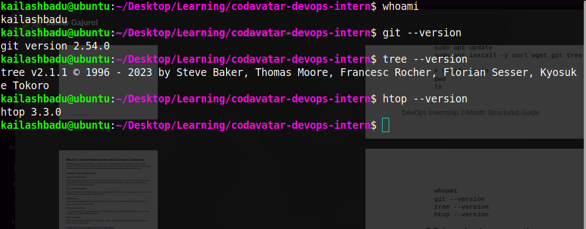

## Linux Command line

**principle:** Terminal is the primary surface for servers. Since most DevOps task are performed using commands over ssh(Secure Shell) without using GUI.

### Paths: absolute path, relative path

A path is a location of a file or directory in linux filesystem.

**example:**

- /home/user/test.txt
- /var/log/nginx/access.log

#### Types of path in linux

1. Absolute path: An absolute path starts from the root of the file system "/". **example:** /var/log/syslog, /home/ubuntu/projects

Absolute paths are used in cron jobs,scripts on servers, system services which are importatn task performed by DevOps.

2. Relative path: A relative path starts from where im currently at. It does'nt start with "/".**example:** test.log,../logs etc. THe problem with the relative path is it can break if we run script from different folders. Suppose we have a scripts what read logs based on relative path ../test.log, the scripts will read the test.log form the parent of where we currenlty executing the scripts.

So, while writing the scripts we should prefer writing absolute path instead of relative paths.

### Home directory

Every thing in a linux is a file. The home directoty is bit confusing at first glance in linux.

"/": I used to think this is the home directory of the root, but this is the root of the linus file systme.

The home directory of the root user is /root and the home direcory of the other user is /home.

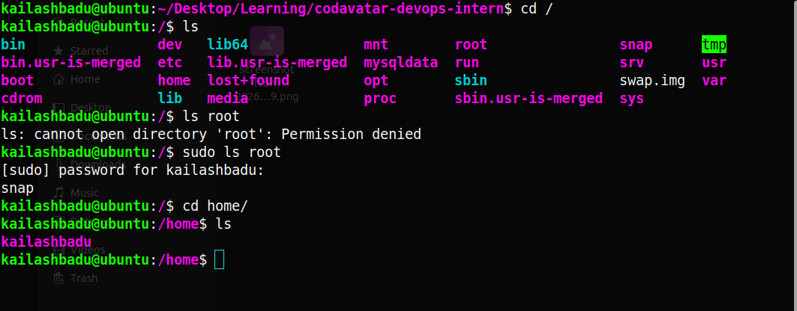

**NOTE** In a linux shell prompt symbols like ~,/,$,# tell who are you, where are you and your privileges level.

```bash
    kailashbadu@ubuntu:/home$ cd
    kailashbadu@ubuntu:~$ sudo su -
    root@ubuntu:~# 

```
#### $

It means normal (non-root) user with limited permissions.It is safe for daily work.It simply means im logged in as a regular user.

#### #

This hashtag symbol means we are in a root/adminstrator shell, we have full system privilges and can modify anything.

#### ~(tilde)

It means home directory of the current user.

for user kailashbadu the ~ means /home/kailashbadu

for root the ~ means /root

`cd` with no arguments automatically takes us to the home directory.

### Current directory:

 Single dot . means the current directory. pwd is used to see the current directory.

```bash
    kailashbadu@ubuntu:~/Desktop/Learning/codavatar-devops-intern$ pwd
    /home/kailashbadu/Desktop/Learning/codavatar-devops-intern
```
 
## Common commands options

These are some of the commands i use daily:
 
 ls, mv, cp,vim, nano,head,tail less, top, more, cat, mkdir, cd, ls, rm, rmdir

###  ls 

The ls command is used to list directory contents in linux and unix systems.

#### Basic Syntax

```bash
    ls [options] [file/dir]
```
1. ls -l -> long listing means shows permissions, owner, size, date.
2. ls -a -> shows all files including hidden files starting with . .
3. ls -A -> it is like -a but it excludes . and .. .
4. ls -h -> human readable sizes
5. ls -i -> shows inode number as well

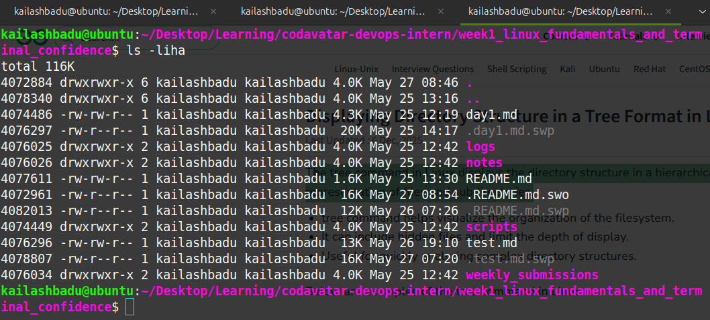

### mv

The mv (move) command in Linux is used to move or rename files and directories. It does not create a copy of the file; instead, it changes its location or name. By default, if a file with the same name exists at the destination, mv overwrites it.

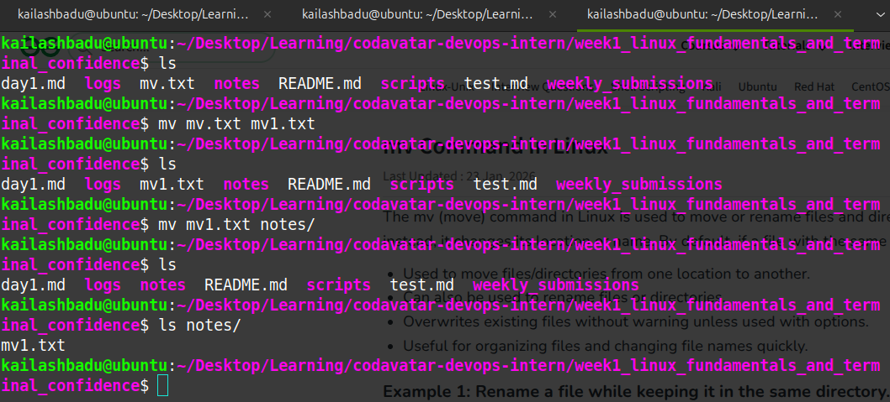

### cp

The cp (copy) command in Linux is used to duplicate files or directories from one location to another within the file system. It supports copying single files, multiple files, and entire directories, with options to control overwriting and attribute preservation.

**syntax**

```bash
    cp Sorce_file Destination_file
```

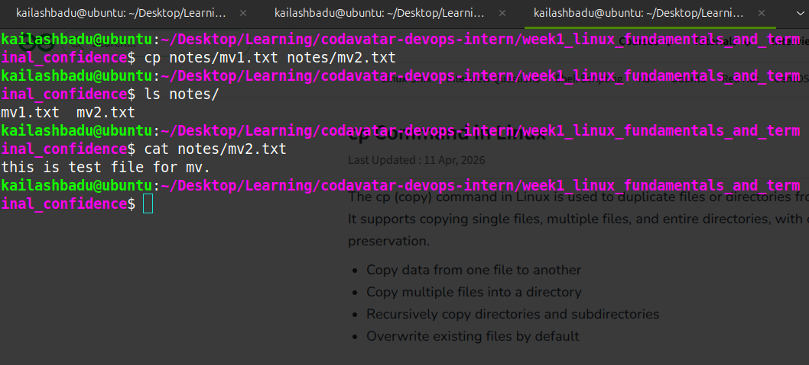

### other commands

```bash
ls -la               # list all files including hidden, with permissions and sizes
cp file1 file2       # copy a file
mv file1 file2       # move or rename a file
rm -i file           # delete with confirmation prompt
mkdir -p a/b/c       # create nested directories in one command
cat file             # print file contents
less file            # scroll through a file page by page
more file            # similar to less but simpler
vim file             # open in vim editor
nano file            # open in nano editor
top                  # live process and resource monitor

```

## FIle System Structure

The Linux File Hierarchy Structure or the Filesystem Hierarchy Standard (FHS) defines the directory structure and directory contents in Unix-like operating systems. It is maintained by the Linux Foundation. 

In the FHS, all files and directories appear under the root directory /, even if they are stored on different physical or virtual devices.

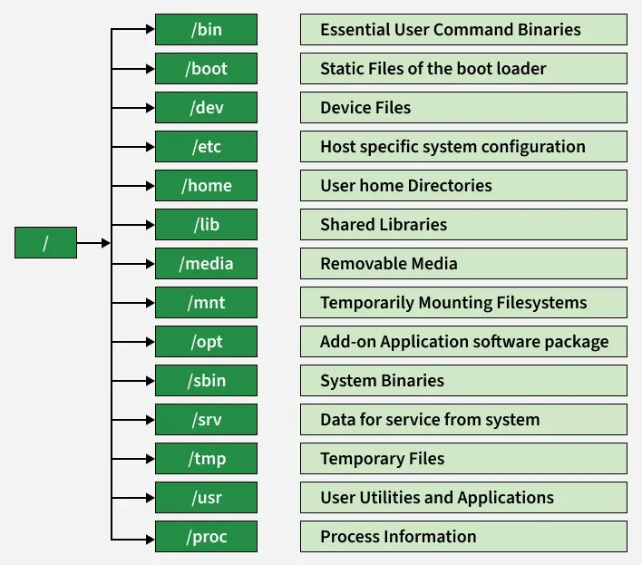


### Symbolic links

- `/sbin -> /usr/sbin`: System binaries for administrative commands (linked to /usr/sbin)
- `/bin  -> /usr/bin ` : Essential user binaries 
- `/lib -> /usr/lib` : Shared libraries and kernel modules

### important system Directories

- `/boot` : Stores files needed for booting the system
- `/usr` : contains most user-installed applications and libraries
- `/var` : it stores logs, caches and temporary files 
- `/etc` : Stores system configuration files.

### temporary and volatile dir

- `/tmp`: Temporary files these files will be cleared on reboot.
- `/run`: hold runtime data for processes.
- `/proc`: Virtual filesystem for process and system info.
- `/sys`: virtual filesystem for hardware and kernel info.
- `/dev`: it contains device files like /dev/nvme0n1

I explored /etc on my own machine and found config files for SSH, cron, network interfaces, and installed packages. This is where I will edit service configuration in later weeks.

## Links

Links are the special files that point to another file or directory. They are widely used in file sharing, storage optimization, configuration management, backup systemsand ci/cd pipelines.

there are two types of linnks: hard link and soft link. the soft link is also called symbolic link / symlink

Before links we need to understand inodes

An inode is a data structure in the linux filesystem that stores metadata about a file.

there are three types of data for a file

- filename, file metadata, and file content

filename leads to file metadata and file meta data leads to file content.

inode stores the metadata of a files like file permissions, owner & group, file size,tiimestamps, Disk block locations but it doesn't store the filename and the content of a file.

file has  different types such as regular files and directory, dir are also the file types.


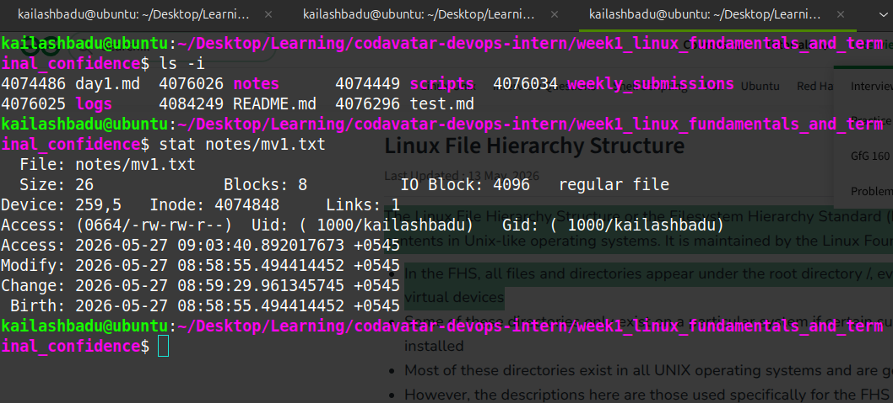

Every file has a filename and an inode number, The filename maps to the inode and the inode maps to actuall data on disk.

### Hard Links

A hard link is another filename pointing to the `same inode`. Both name are completely equal, there is no "original" vs "copy"

**syntac**

```bash
    ln file1 file2
```

to verify `ls -li` the number after the permissison string is the hardlink count pointing to the same inode.

Even if we remove `rm file1` the file2 still survives. Data is only removes when all hard links pointing to the inode are deleted.


#### Characterstics of the inode

- the inode of new link is the same as original
- link count is incremented with each hard link.
- survives source deletion
- since inode numbers are filesystem-local so hardlink cannot be created in cross filesystems.
- the hardlinks cannot link directories

we can think hardlink as A house with  two front doors, deleting one door doesn't demolish the house.

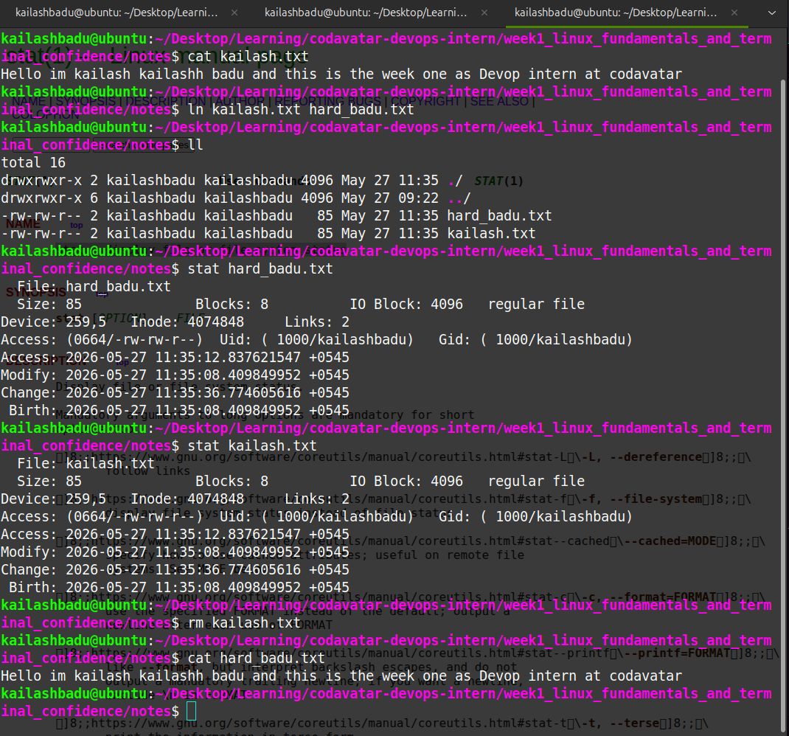

### Soft Links

A softlink is a special file that stores the path to another file or directory.It doesnt references the inode directly.

```bash
    softlink.txt ------> stores path string "/home/user/file.txt"
    
```

the inode number of each softlink is different ans hence it  consume more space than the hardlonks.

#### Creating a softlink

```bash
    ln -s file1.txt sotlink.txt
```

and verify it by `ll -i`

the `l` symbol at the first of the permission string denotes that it is a softlink.

when the main file is deleted rm file1 then the softlink becomes dangling link, it means the symblink exists but point to nothing.

#### Characterstics

- the inode number is different form the original
- it doesnt survives the source deletion
- the soft link can be created in cross filesystem.
- and the soft link can link directories

Soft link is similar to a paper note with a house address if the house if demolished the note becmoes useless.


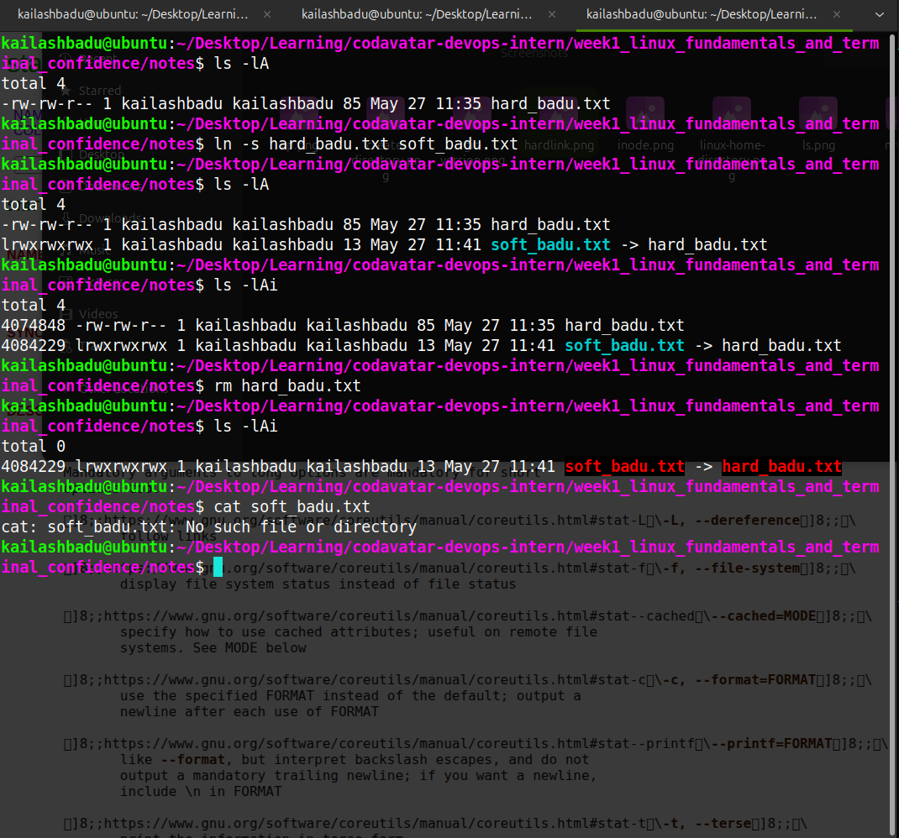


## Permissions

In linux permissionsa define who can access a file or directory and what actions teht can perfom.

Every file has three types of permissions. Read(r), write(w), execute(x)

And the three types of usets: Owner(user), Group(g), others(o)

THe users who created the file is owner. THe users who belongs to the same group is the groups user and all the other user in the system are others.

r= View file content
w= modify file
x= fun file or script

we can simply view the permissions using the command `ls -l or ll`

```bash
kailashbadu@ubuntu:~/Desktop/Learning/codavatar-devops-intern/week1_linux_fundamentals_and_terminal_confidence$ ll
total 76
drwxrwxr-x 7 kailashbadu kailashbadu  4096 May 27 12:30 ./
drwxrwxr-x 6 kailashbadu kailashbadu  4096 May 27 11:51 ../
drwxrwxr-x 2 kailashbadu kailashbadu  4096 May 27 12:08 backup/
-rw-rw-r-- 1 kailashbadu kailashbadu  4401 May 25 12:19 day1.md
drwxrwxr-x 2 kailashbadu kailashbadu  4096 May 25 12:42 logs/
drwxrwxr-x 2 kailashbadu kailashbadu  4096 May 27 12:05 notes/
-rw-rw-r-- 1 kailashbadu kailashbadu 13276 May 27 12:24 README.md
-rw-r--r-- 1 kailashbadu kailashbadu 24576 May 27 12:38 .README.md.swp
drwxrwxr-x 2 kailashbadu kailashbadu  4096 May 25 12:42 scripts/
drwxrwxr-x 2 kailashbadu kailashbadu  4096 May 25 12:42 weekly_submissions/

```

explanation of `-rw-rw-r-- 1 kailashbadu kailashbadu  4401 May 25 12:19 day1.md`

- -rw-rw-r-- : this is permission string it has 664 permission means owner have read and write perm and same as the gruoup while all other user in the system has only read perm

- 1 is the count of hardlink

- kailashbadu is the owner user

- kailashbadu is the group name

- 4401 is the sze of the file 4.4kb

- may 25 12:19 is the timestamps

- day1.md is the name of the file

### Changing permissions

we use chmod to hange the permission of the 

```bash
chmod u+x file.sh   # add execute to owner
chmod g-w file.sh   # remove write from group
chmod o+r file.sh   # add read to others
chmod a+rwx file.txt # all permissions to all
chmod u=rwx,g=rw,o=r script.sh

```  

we can change this with the numeric (octal 3 bit mehtod)

7- rwx
6 - rw-
5 - r-x
4 r--

Too change the ownweship of the file we use chown.

Every file belongs to auser and a group.

`chown user file.sh # change owner`
`chown user:group file.sh` change owner and group


to the group fo the file we can use chgrp

`chgrp kailash file.txt`


## Processed and logs


journalctl,less, more,cat, grep , pgrep , top, df -h, du -h, free, 

## Networking

netstat, dig, nslookup, traceroute, curl, wget, ip addr, ip, ping, telnet


## Scheduling with cron jobs

## Systemd services systemctl and jornalctl

## file searching

find, grep, awk,sed, 

## Archives and compression

tar,gzip, zip

## Disk and storage understanding
lsblk,blkid, mount, umount df -h, du -sh

## logs dir structure

/var/log
/var/log/syslog
/var/log/auth.log
/var/log/nginx
/var/log/apache2


## Bash Scripting

shebang 

```bash
#!/bin/bash

set -euo pipefail

ls 

```
# Practical Commands and Lab flow

```bash
# Task 1
mkdir -p ~/devops-internship/week1/{scripts,logs,notes,backup}
cd ~/devops-internship/week1
pwd
tree

# Output below in ss

# Task 2
echo "DevOps Linux Practice" > notes/intro.txt
cp notes/intro.txt backup/intro-copy.txt
mv backup/intro-copy.txt backup/intro-backup.txt
rm -i backup/intro-backup.txt

# Task 3
cat > scripts/system_info.sh <<'EOF'
#!/bin/bash
echo "User: $(whoami)"
echo "Date: $(date)"
echo "Current directory: $(pwd)"
echo "Disk usage:"
df -h
echo "Memory usage:"
free -h
EOF
chmod +x scripts/system_info.sh
./scripts/system_info.sh | tee logs/system-info.log
grep "User" logs/system-info.log
ps aux | head
top
```


## Screnshots
## task 1
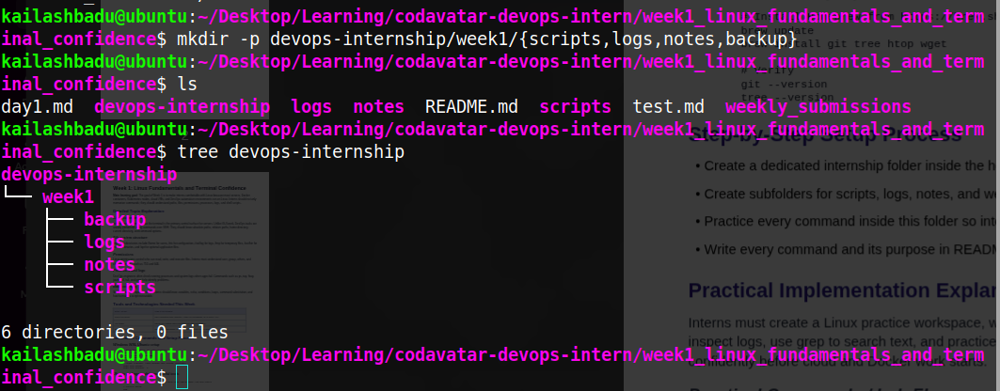

## task 2
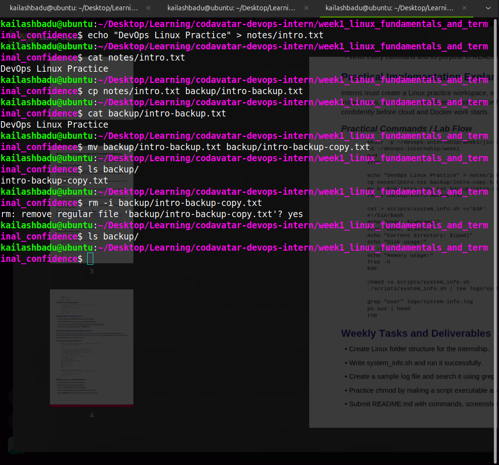

## task 3


## Commands used for tasks and their practical meaning

### task 1

- mkdir -p devops-internship/week1/{scripts,logs,notes,backup}: this creates multipe directory in a hierarchical way.-p tells is no pareent directory create and then crete those directory so when i enter the command then if the parent directory is already present then it creates the child directoy if the parent directory is absent then it creates the parent directory first.

- pwd : this command is used to print the presetn working directory.

- tree: it display directory structure in a tree format. The tree command in Linux displays the directory structure in a hierarchical, tree-like format, providing a clear visual representation of files and subdirectories.

- sudo apt update: it updates the package lists for upgrades for packages that need upgrading, as well as new packages that have just come to the repositories.   

- stat:  display file or file system status


### task 2

- `echo "DevOps Linux Practice" > notes/intro.txt` : echo command is used to print the content in the termnal but here the content is redireted to the notes/intro.txt . if the file is not present it create the file and write the content. similar to this `>` there is another '>>' the only difference is that `>` replaces the whole content while `>>` just append the content to the end of the file

- ``cat notes/intro.txt: The cat (concatenate) command in Linux is used to view, create, and combine file contents directly from the terminal. It allows users to quickly work with file content without opening a text editor. Primarily used to display the contents of files on the terminal.It Can concatenate multiple files and display them as a single continuous output.

- `cp notes/intro.txt backup/intro-backup.txt`: it copies the file intro.txt from notes dir to intor-backup.txt in backup dir

- `mv backup/intro-backup.txt backup/intro-backup-copy.txt` here the mv command is used to rename the file intro-backup.txt to into-backup-copy.txt

- `rm -i backup/intro-backup-copy.txt`: this commnds is used to remove or delte the intro-backup-copy.txt file and the flag -i is used to confirm before deleting.


## References

- https://www.geeksforgeeks.org/linux-unix/linux-file-hierarchy-structure/
- inode: https://www.youtube.com/watch?v=ScDv02ff8oc
 
