# Scouce code management
SCM is used ti track modifications to a source code reposotory.SCM tracks the running history of changes to a code base and helps resolve conflicts when merginf updates from multiple contributos. SCM us also synonymous with version control.

## What is Version Control?

Version control is a system that records changes to files over time so you can recall specific versions later.

**Without version control:**
- You manually save files like `app_v1.py`, `app_v2_final.py`, `app_v2_FINAL_final.py`
- Collaboration becomes chaotic where two people overwrite each other's work
- There is no way to trace who changed what and when
- Rolling back a mistake means manually comparing dozens of files

**With Git:**
- Every change is recorded with who made it, when, and why
- Multiple people work on isolated branches without interfering
- Rolling back a change is a single command
- The entire history of a project is stored and queryable

**Types of version control:**
- **Local VCS**: changes tracked on one machine only (risky)
- **Centralized VCS**: one central server, everyone connects to it (SVN, CVS)
- **Distributed VCS**: every contributor has a full copy of the history (Git)

Git is distributed. Even without an internet connection, you can commit, branch, and view history locally.

## SCM/version control in DevOps lifecycle

```bash
Dev ----> commit code -----> SCM(git)-----> CI pipeline ---------> CD pipeline -------> prod
```

### flow

- Dev pushes code to the repo.
- SCM triggers the CI pipeline
- code is built and tested.
- CD pipelines deploys applications

## Branching Startegy

A branching strategy is something a software development team uses when interacting with a version control system for writing and managing code.

### Why you need a DevOps branching strategy

A properly implemented branching strategy is the key to creating an efficient DevOps process. DevOps is focused on creating a fast, streamlined, and efficient workflow without compromising the quality of the end product.

A DevOps branching strategy helps define how the delivery team functions and how each feature, improvement, or bug fix is handled. It also reduces the complexity of the delivery pipeline by allowing developers to focus on developments and deployments on the relevant branches—without affecting the entire product.

### Determining the best branching strategy for your needs

It depends.

A good branching strategy for DevOps should have the following characteristics:

- Provides a clear path for the development process from initial changes to production.
- Allows users to create workflows that lead to structured releases.
- Enables parallel development.
- Optimizes developer workflow without adding any overhead.
- Enables faster release cycles.
- Efficiently integrates with all DevOps practices and tools, such as different version control systems.
- Offers the ability to enable GitOps if it is a requirement.

### Git flow

- main -> production
- develop -> integration
- feature -> new features
- release -> release prep
- hotfix -> urgent fixes

## Truck based development
- sigle main branch
- short lived feature branch
- frequent commit
- faster ci/cd


## source code management best practices

1. commit often
2. ensure you are working from latest verison
3. make detailed notes
4. Review changes before commiting
5. use branches
6. Agree on workflow: SCM workflows establish patterns ans processes for merging branches. If a team dosent agree on a shared workflow it can lead to inefficient communicatino overhead when it coes time to merger branches.

---

## Git

Git is a stream of snaoshots.

Git is a mini file systems so it has a hidden directory called .git, inside it all of our object located.

Objects are really inportant in git.

### How Git Works Internally

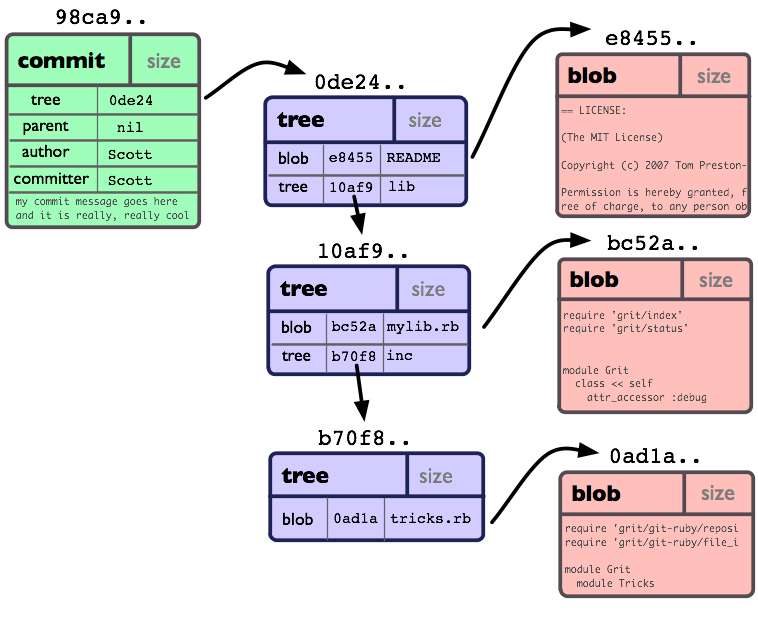

Understanding Git internals helps us debug problems instead of guessing.

**blob:** A "blob" is used to store file data - it is generally a file. Blob will save the contents of the file without the filename, if we have serverla files for the same content, they are saved as one blob, the blob is then compressed.

Each object is git will have a unique indentifier called SHA-1 hash

**Tree:** A "tree" is basically like a directory - it references a bunch of other trees and/or blobs (i.e. files and sub-directories)

**Commit:** A "commit" points to a single tree, marking it as what the project looked like at a certain point in time. It contains meta-information about that point in time, such as a timestamp, the author of the changes since the last commit, a pointer to the previous commit(s), etc.

**Tag:** A "tag" is a way to mark a specific commit as special in some way. It is normally used to tag certain commits as specific releases or something along those lines.


**Three areas of Git:**

```
Working Directory   -->   Staging Area (Index)   -->   Repository (.git)
(our files)            (what you plan to save)       (permanent history)
```

Working Directory: they conatins files we actively editing, we can just edit files normally to move file here

Staging Area: they contains the  changes selected for next commit and we cn add file in the staging area by `git add filename`

Repository: it contains the  committed history and we can add the files in this stage by  `git commit -m "message"` 


**What a commit really is:**

A commit is a snapshot of all staged files at that moment. Git stores this as a hash (a unique ID like `a3f8d2c`). Every commit points to its parent commit, forming a chain called the **commit history**.

**What HEAD means:**

`HEAD` is a pointer to the current commit you are on. When you switch branches, `HEAD` moves. It tells Git "this is where you are right now."

---
## Branches

a git branch is a lightweight, movable pointer to a specific commit, representing and independent line of develpoment that allows changes to be made withour affecting the main project code.

By default git creates a main branch when a repository is initialized, and this pointer moves forward automatically with each new commit.

creatinng a branch simply involves writing a pointer to a file rather than copying project files. THis enabales developers to isolatework on new features, bug fixes, or experiments keeping the main branch stable and production ready until those changes are validated and merged back in.

**Why branches?**

The `main` branch is the stable, production-ready version of the code. You never work directly on `main` in a team. Instead, you create a branch, do your work, and merge it back after review.


### branch operations in git

1. **Listing branches** git branch. current branch is marked by an asterisk.
2. **Create a branch** use git branch <name> to create a branch without swithcing to it, ot git switch -v <name>, to create and swicth simultaneously. we can slo use git checkout -b <branchname> to create an switch branch simulataneously.
3. **Delete a branch:** USe git origin branch -d <branchname> to safely delete a merged branch, or git branch -D <branchname> to force delete it regardless of merge status.
4. **Merge changes:** Once work is compled , switch to the main branch and use git merge <branch_name> to integrate the changes


#### Branch Commands

```bash
# List all local branches
git branch

# List all branches including remote
git branch -a

# Create a new branch
git branch branch-name

# Switch to an existing branch
git checkout branch-name

# Create AND switch in one command (preferred)
git checkout -b branch-name

# Modern alternative (Git 2.23+)
git switch -c branch-name

# Delete a branch (safe — only if merged)
git branch -d branch-name

# Force delete (even if not merged)
git branch -D branch-name

# Rename current branch
git branch -m new-name
```
#### Merging

```bash
# Switch to the branch you want to merge INTO
git checkout main

# Merge another branch into current branch
git merge week2-git-cicd

# Merge with a merge commit always (no fast-forward)
git merge --no-ff week2-git-cicd
```

**Fast-forward vs no-fast-forward:**

- **Fast-forward**: If `main` has not changed since the branch was created, Git simply moves the `main` pointer forward. No extra commit is created.
- **No-fast-forward**: Always creates a merge commit, preserving the branch history. Recommended for feature branches.

---


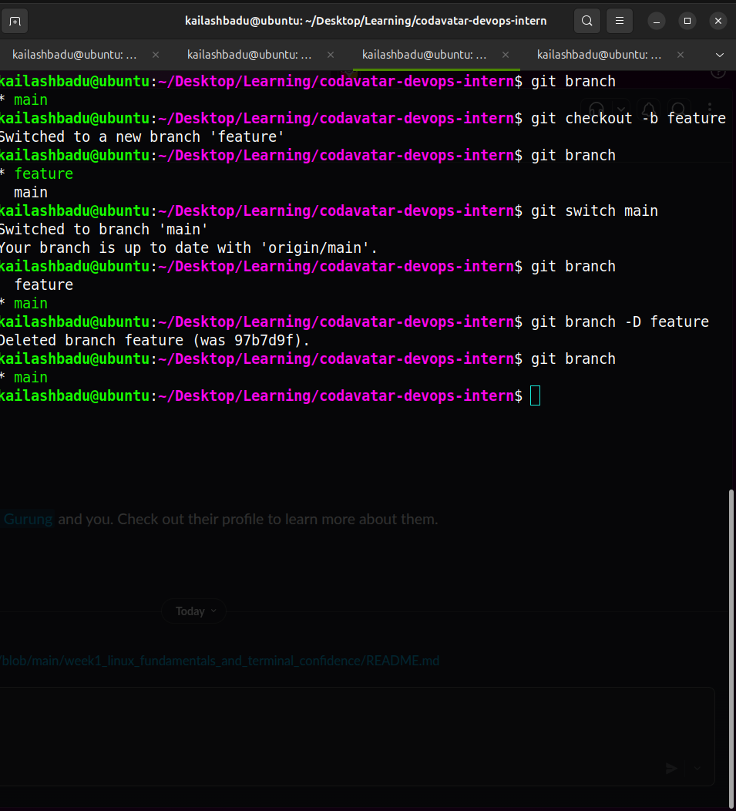

### combinig branch

git merge and git fetch are the two primary methods for integrating changes form one banch into another.

they differ fundamentally in how they handle commits, history.

Git merge preserves the original development history by creating a "new merge commit" that links to the divergent branches, resulting in non-linewar, graph like structure, this apprrocah is a non-destructiove and safe for public, shared branches because it maintains a complete audit of when and how features were integrated.

Git rebase creates a perfectly linear history by rewriting commits, it takes the changes from a source branch and replays them on top of the target branch's latest commit,creating a new commmit hasshes in the process. The result is cleaner and easier to read log but is destructive to the original history.Consequently, the golder rule of the rebasing dictates that you should never rebase a branch that has been published or shared with others, as it causes divergent hostories and confusion for collaborators. Simply rebase means rewriting the history.

git commits are immutable but branch are mutable, so rebase created a new commit wrth new SHA-1.


Usually we will be merging our master branch to feature branch to test and other stuf.

While merging we may have merge conflict. If two devs or the two different branches are working in the same part of the same file then the conflict occur, we need to solve it  manually.

or we can do git merge --abort.


In git merge we have one conflict per merge but in git rebase we have conflicts as many as the number of commits we are rebasing.

**Git most important rule** Never alter commit that you've shared.

---

### Core Git Commands

#### Initializing a Repository

```bash
# Create a new Git repository in current folder
git init

# This creates a hidden .git folder that stores all Git data
ls -la
# You will see .git listed
```

#### Checking Status

```bash
# See what files are modified, staged, or untracked
git status

# Short version
git status -s
```
#### Adding Files to Staging

```bash
# Stage one specific file
git add filename.txt

# Stage a folder
git add foldername/

# Stage everything in current directory
git add .

# Stage parts of a file interactively (advanced)
git add -p filename.txt
``` 
 **Important:** `git add .` adds ALL changed and new files. Be careful  we might accidentally stage files you did not intend to.

#### Committing

```bash
# Commit staged changes with a message
git commit -m "feat: add system info script"

# Commit and stage tracked files in one step (does not add new untracked files)
git commit -am "fix: correct path in backup script"

# Open editor to write a longer commit message
git commit
```

**Good commit message format**

```
type: short description (max 72 characters)

Optional longer explanation of what and why (not how).
```
- `feat`: New feature or functionality 
- `fix`: Bug fix 
- `chore`: Maintenance, tooling, no code change
- `docs`: Documentation update
- `ci`: CI/CD pipeline changes |
- `refactor`: Code restructure without behavior change |
- `test`: Adding or updating tests |

**Examples:**
```
feat: add week1 linux scripts
fix: correct permission on system_info.sh
docs: update README with commands
ci: add github actions basic check workflow
chore: add week2 folder structure
```
---

### Working with Remotes

A **remote** is a copy of your repository stored on another server (like GitHub).

```bash
# View remote connections
git remote -v

# Add a remote named 'origin' pointing to GitHub
git remote add origin git@github.com:USERNAME/repo-name.git

# Change remote URL
git remote set-url origin git@github.com:USERNAME/new-repo.git

# Remove a remote
git remote remove origin
```

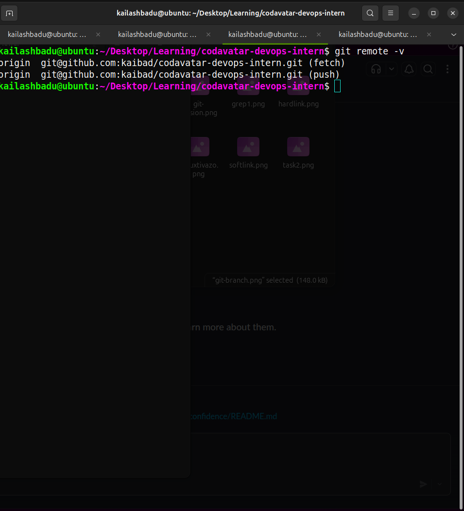

#### Pushing and Pulling

```bash
# Push local branch to remote for the first time
git push -u origin branch-name

# After -u is set, just use:
git push

# Push all branches
git push --all

# Pull latest changes from remote (fetch + merge)
git pull

# Fetch changes without merging
git fetch origin

# Pull and rebase instead of merge
git pull --rebase
```

**What `-u` does:** Sets the upstream tracking. After `git push -u origin main`, Git knows that `origin/main` is the remote counterpart of your local `main`. Future `git push` and `git pull` will automatically use this connection.


```bash
# Clone a repository (downloads full history)
git clone git@github.com:USERNAME/repo-name.git

# Clone into a specific folder name
git clone git@github.com:USERNAME/repo-name.git my-folder

# Clone only the latest commit (shallow clone — faster for large repos)
git clone --depth=1 git@github.com:USERNAME/repo-name.git
```
---

### Merge Conflicts

A merge conflict happens when two branches changed the same line of a file differently.

**Example:**
```
Branch main:    "Server running on port 3000"
Branch feature: "Server running on port 8080"
```
Git cannot decide which one is correct — you must resolve it manually.

**What a conflict looks like in the file:**

```
<<<<<<< HEAD
Server running on port 3000
=======
Server running on port 8080
>>>>>>> feature-branch
```
**How to read it**

- HEAD = the version from the branch you were on when you started the merge (likely main)
- feature = the version from the feature branch

Now you must decide which behavior you want.

**How to resolve:**

1. Open the conflicted file in VS Code or any mergetool
2. Delete the conflict markers (`<<<<<<<`, `=======`, `>>>>>>>`)
3. Keep the correct code (or combine both)
4. Save the file
5. Stage and commit the resolution

```bash
# After resolving all conflicts:
git add conflicted-file.txt
git commit -m "fix: resolve merge conflict in server port"
```
---

**VS Code makes this easier** — it shows a UI with buttons: Accept Current Change, Accept Incoming Change, Accept Both.


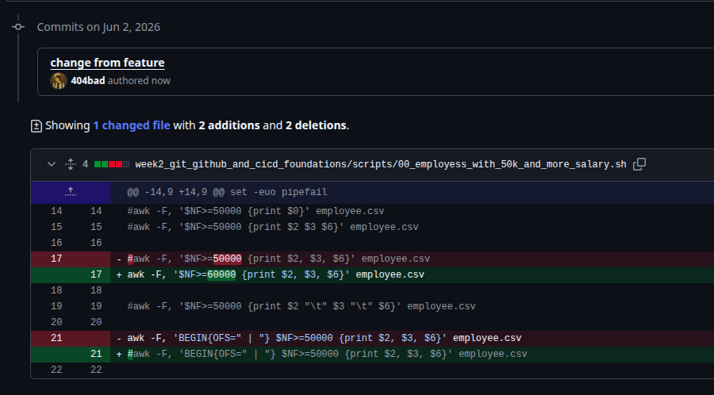
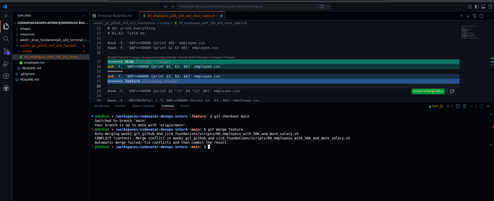
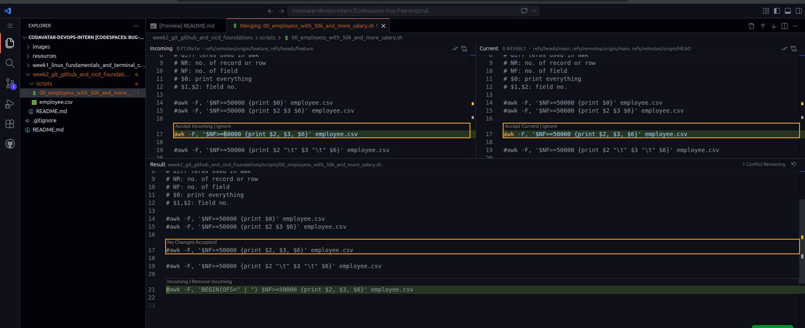
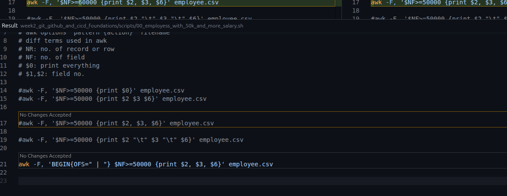

---

### Git Log and History

```bash
# View full commit history
git log

# Compact one-line view
git log --oneline

# Last 5 commits
git log --oneline --max-count=5

# Graphical branch view in terminal
git log --oneline --graph --all

# Show what changed in each commit
git log -p

# Search commits by message
git log --grep="feat"

# Show who changed each line of a file
git blame filename.txt

# Show changes in a specific commit
git show commit-hash
```
---

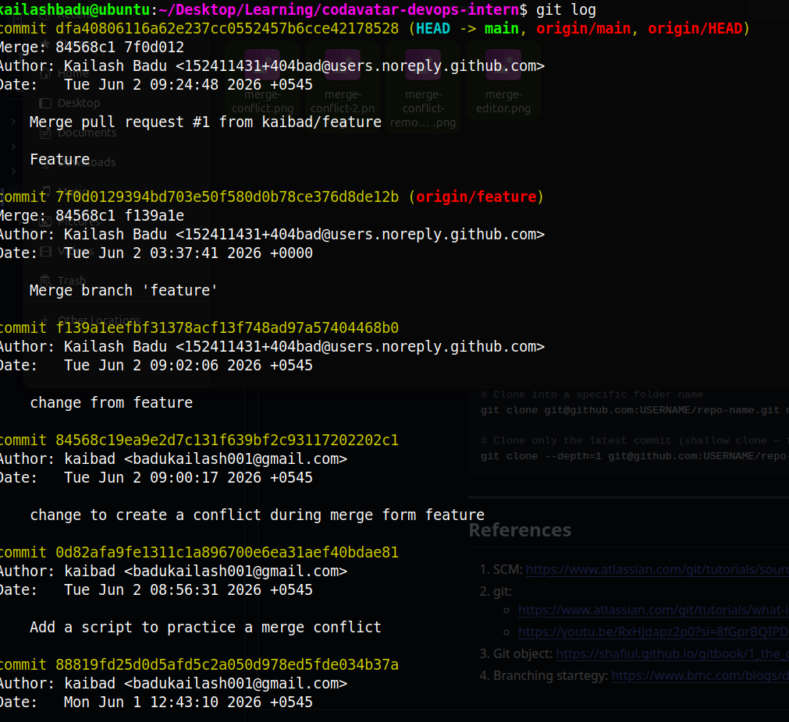
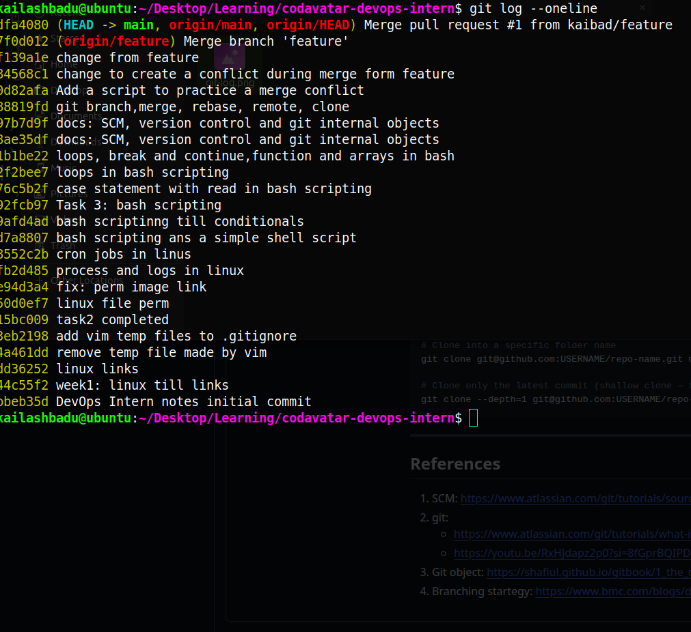
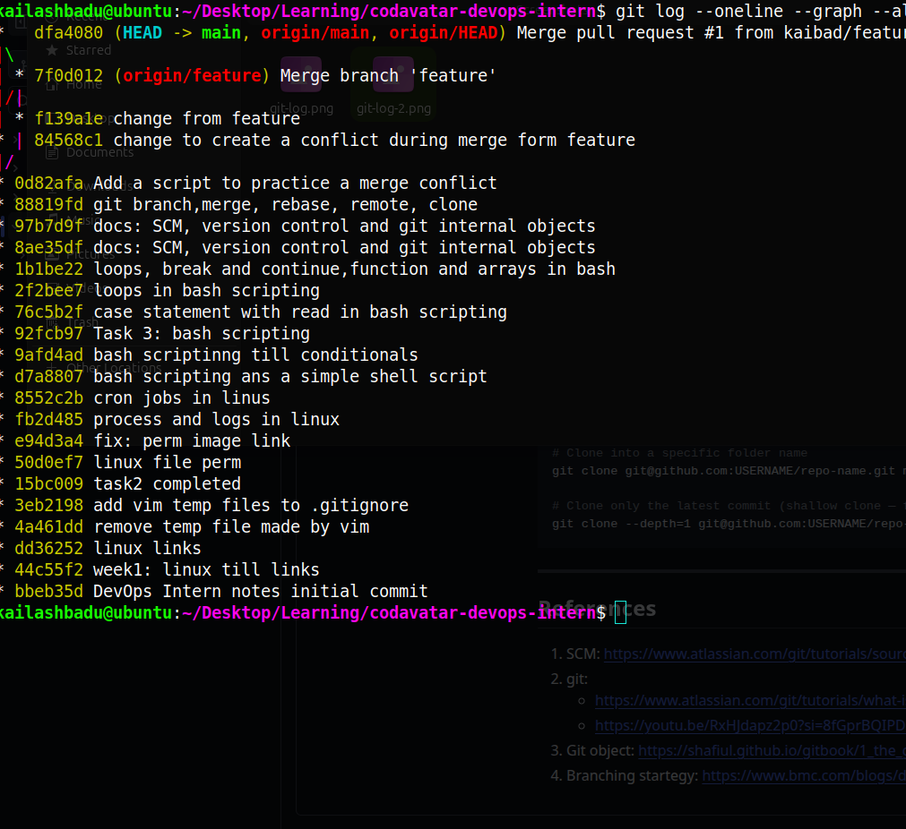

---
### Undoing Changes

```bash
# Discard changes in working directory (CANNOT be undone)
git checkout -- filename.txt
# Modern syntax:
git restore filename.txt

# Unstage a file (keeps changes in working directory)
git reset HEAD filename.txt
# Modern syntax:
git restore --staged filename.txt

# Undo last commit but keep changes staged
git reset --soft HEAD~1

# Undo last commit and unstage changes (keep files modified)
git reset --mixed HEAD~1

# Undo last commit and DELETE all changes (DANGEROUS)
git reset --hard HEAD~1

# Create a new commit that reverses a previous commit (safe for shared branches)
git revert commit-hash
```

> **Rule:** Never use `git reset --hard` or force-push on shared branches. It rewrites history and breaks everyone else's work.

---

### git stash

`git stash` temporarily saves your uncommitted work so you can switch branches or do something else, then come back and restore it.

**The problem it solves:** You are halfway through work on `feature-branch` and need to urgently switch to `main` to fix a bug. You cannot commit half-done work. `git stash` saves it temporarily.

```bash
# Stash current changes (working dir + staged)
git stash

# Stash with a descriptive name
git stash push -m "half-done login form"

# Stash including untracked files (new files not yet added)
git stash push --include-untracked

# List all stashes
git stash list
# stash@{0}: On feature-branch: half-done login form
# stash@{1}: WIP on main: a1b2c3 fix typo

# Apply the most recent stash (keeps stash in list)
git stash apply

# Apply a specific stash
git stash apply stash@{1}

# Apply most recent stash AND remove it from list
git stash pop

# Remove a specific stash without applying
git stash drop stash@{0}

# Remove all stashes
git stash clear

# Show what is in the most recent stash
git stash show

# Show full diff of a stash
git stash show -p stash@{0}
```

**Typical stash workflow:**

```bash
# You are on feature-branch with unsaved work
git stash push -m "WIP: login validation"

# Switch to fix urgent bug on main
git checkout main
# ... fix the bug, commit, push ...

# Return to your feature
git checkout feature-branch
git stash pop
# Your work is restored exactly as you left it
```

---

### git cherry-pick

`git cherry-pick` copies a specific commit from one branch and applies it to your current branch. You pick one commit and "cherry-pick" just that change.

```bash
# Apply a specific commit to current branch
git cherry-pick a1b2c3

# Cherry-pick multiple commits
git cherry-pick a1b2c3 d4e5f6

# Cherry-pick a range of commits
git cherry-pick a1b2c3..g7h8i9

# Cherry-pick without committing (apply changes but don't commit yet)
git cherry-pick --no-commit a1b2c3

# If a conflict occurs during cherry-pick:
# 1. Resolve the conflict
git add resolved-file.txt
# 2. Continue
git cherry-pick --continue
# Or abort
git cherry-pick --abort
```

**When to use cherry-pick:**

**Situation:** A bug fix is on a feature branch but needs to go to main immediately . **example:** Pick just the fix commit onto main

**situation** You accidentally committed to the wrong branch **example** Cherry-pick it to the right branch, then drop it from wrong one

**situation**  You need one specific feature from an old branch **example**  Pick just that commit

```bash
# Example: bug fix on feature branch needs to go to main
git log feature-branch --oneline
# a1b2c3 fix: critical security patch   ← you want this
# d4e5f6 feat: half-done feature

git checkout main
git cherry-pick a1b2c3
# The fix is now on main without bringing the unfinished feature
```

---

### git diff

`git diff` shows exactly what changed between files, commits, or branches.

```bash
# Show unstaged changes (working dir vs staging area)
git diff

# Show staged changes (staging area vs last commit)
git diff --staged
# Also written as:
git diff --cached

# Show changes between two commits
git diff a1b2c3 d4e5f6

# Show changes between two branches
git diff main feature-branch

# Show changes in a specific file only
git diff filename.txt

# Show only file names that changed (no content)
git diff --name-only

# Show summary of how many lines changed per file
git diff --stat

# Show changes between local and remote main
git diff main origin/main

# Show difference between last commit and 2 commits ago
git diff HEAD HEAD~2
```

**Reading diff output:**

```diff
--- a/scripts/system_info.sh     ← original file
+++ b/scripts/system_info.sh     ← modified file
@@ -3,7 +3,8 @@                  ← line numbers affected
 echo "User: $(whoami)"
-echo "Date: $(date)"            ← removed line (red)
+echo "Date: $(date '+%Y-%m-%d')"← added line (green)
+echo "Uptime: $(uptime -p)"     ← new line added (green)
 echo "Current directory: $(pwd)"
```

Lines starting with `-` were removed. Lines starting with `+` were added. Lines with no prefix are context (unchanged).

---

### git tag

Tags mark specific commits as important — usually version releases. Unlike branches, tags do not move.

```bash
# Create a lightweight tag on current commit
git tag v1.0.0

# Create an annotated tag (recommended — stores tagger, date, message)
git tag -a v1.0.0 -m "Release version 1.0.0 - Week 2 complete"

# Tag a specific commit (not current)
git tag -a v0.9.0 a1b2c3 -m "Beta release"

# List all tags
git tag

# List tags matching a pattern
git tag -l "v1.*"

# Show tag details and the commit it points to
git show v1.0.0

# Push a specific tag to remote
git push origin v1.0.0

# Push all tags to remote
git push origin --tags

# Delete a local tag
git tag -d v1.0.0

# Delete a remote tag
git push origin --delete v1.0.0

# Checkout code at a specific tag (detached HEAD state)
git checkout v1.0.0
```

**Semantic versioning (SemVer) — standard tag naming:**

```
v MAJOR . MINOR . PATCH
v  1   .   2   .   3

MAJOR: Breaking changes (not backward compatible)
MINOR → New features (backward compatible)
PATCH → Bug fixes only
```

Examples: `v1.0.0`, `v2.3.1`, `v0.9.0-beta`, `v1.0.0-rc1`

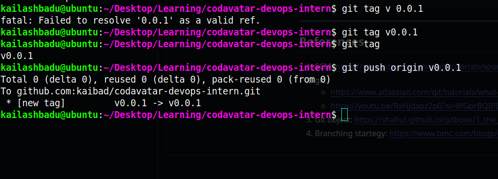
---
## GitHub

GitHub is a cloud platform for hosting Git repositories. It adds collaboration features: pull requests, issues, code review, Actions (CI/CD), and more.

### Setting Up SSH Key Authentication

GitHub no longer accepts passwords for Git operations. You must use SSH keys or personal access tokens.

**SSH key = a pair of keys:**
- **Private key**  stays on your machine, never shared
- **Public key**  uploaded to GitHub

When you push, GitHub verifies you have the private key that matches the public key on record.

```bash
# Step 1: Generate SSH key pair
ssh-keygen -t ed25519 -C "your-email@example.com"
# Press Enter to accept default location (~/.ssh/id_ed25519)
# Set a passphrase (optional but recommended)

# Step 2: Start the SSH agent
eval "$(ssh-agent -s)"

# Step 3: Add private key to the agent
ssh-add ~/.ssh/id_ed25519

# Step 4: Copy public key to clipboard
cat ~/.ssh/id_ed25519.pub
# Copy the entire output

# Step 5: Add to GitHub
# Go to: GitHub → Settings → SSH and GPG keys → New SSH key
# Paste the public key and give it a title like "WSL Ubuntu" or "MacBook"

# Step 6: Test the connection
ssh -T git@github.com
# Expected output: "Hi USERNAME! You've successfully authenticated..."
```

---

### GitHub CLI (gh)

The GitHub CLI lets you manage GitHub directly from your terminal — create repos, open PRs, view issues — without opening the browser.

```bash
# Install on Ubuntu/WSL
sudo snap install gh
# OR
sudo apt install gh

# Install on macOS
brew install gh

# Login
gh auth login
# Choose: GitHub.com → SSH → browser login

# Check authentication
gh auth status
```

**Useful gh commands:**

```bash
# Create a new repository
gh repo create devops-internship-labs --public

# Clone a repository
gh repo clone USERNAME/repo-name

# View open pull requests
gh pr list

# Create a pull request
gh pr create --title "Week 2 CI/CD setup" --body "Added GitHub Actions workflow"

# Merge a pull request
gh pr merge 1

# View issues
gh issue list

# Create an issue
gh issue create --title "Fix login bug" --body "Login fails on mobile"
```

---

### GitHub Repository Setup

```bash
# Option A: Create on GitHub first, then clone
gh repo create devops-internship-labs --public --clone
cd devops-internship-labs

# Option B: Initialize locally and push to GitHub
cd ~/devops-internship
git init
git add .
git commit -m "chore: initial commit with week1 linux work"
git branch -M main
git remote add origin git@github.com:YOUR_USERNAME/devops-internship-labs.git
git push -u origin main
```
---

### Pull Request Workflow

A **Pull Request (PR)** is a request to merge your branch into another branch (usually `main`). It is the central place for code review in professional teams.

**Standard PR workflow:**

```
1. Create branch         git checkout -b week2-git-cicd
2. Make changes          edit files, write code
3. Commit changes        git add . && git commit -m "..."
4. Push branch           git push -u origin week2-git-cicd
5. Open PR on GitHub     Compare & pull request button
6. CI checks run         GitHub Actions validates the code
7. Code review           Teammates leave comments
8. Address feedback      Make more commits on same branch
9. Merge PR              Squash and merge or merge commit
10. Delete branch        Clean up after merge
```

**Creating a PR from terminal:**

```bash
gh pr create \
  --title "ci: add github actions basic check workflow" \
  --body "Adds a workflow that runs on push and PR to validate shell scripts and show repo files. Closes #1"
```

**PR description best practices:**
- What does this PR do?
- Why was this change needed?
- How was it tested?
- Screenshots if UI changed
- Link to related issue: `Closes #issue-number`

---

### GitHub Best Practices

**Branch naming:**
```
week2-git-cicd
feature/user-login
fix/docker-port-conflict
chore/update-dependencies
```

**What NOT to commit:**
- Passwords, API keys, tokens, secrets
- `.env` files with real credentials
- `node_modules/`, `__pycache__/`, build artifacts
- Large binary files

**Use `.gitignore`:**

```bash
cat > .gitignore <<'EOF'
# Environment files
.env
.env.local
.env.production

# Dependency folders
node_modules/
__pycache__/
*.pyc

# Build output
dist/
build/
*.class

# OS files
.DS_Store
Thumbs.db

# IDE
.vscode/settings.json
.idea/
EOF

git add .gitignore
git commit -m "chore: add gitignore"
```

---

## References

1. SCM: https://www.atlassian.com/git/tutorials/source-code-management
2. git: 
   - https://www.atlassian.com/git/tutorials/what-is-git
   - https://youtu.be/RxHJdapz2p0?si=8fGprBQIPDsPVcnui
3. Git object: https://shafiul.github.io/gitbook/1_the_git_object_model.html
4. Branching startegy: https://www.bmc.com/blogs/devops-branching-strategies/
