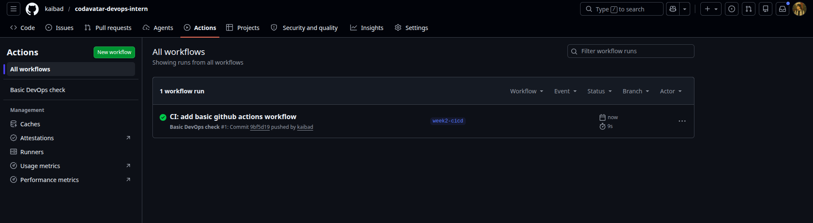
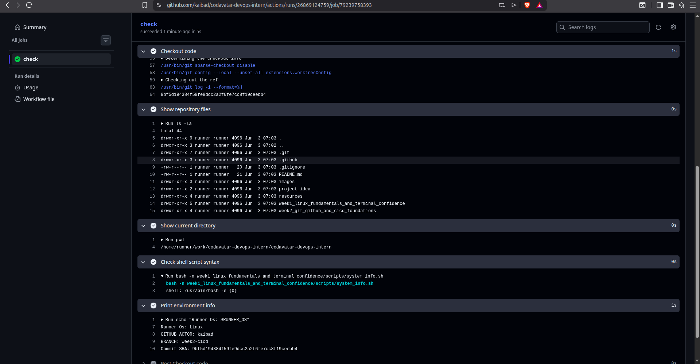

# Devops
DevOps is a cultural and technical improvement that combines develpoment (Dev) AND OPERATIONS (Ops) teams to work, collaboratively thoughout the entire software development and delivery lifrcycle. it breaks down the traditional silos between the teams that write cide and the teas that deploy and maintain it.

DeVops is not just a set of tools, it is a mindset, cultureand set of practices aimed at

- Shortening the software develpoment lifecycle
- Delivering high quality software cintinuosuly.
- Increasing collaboration ans commicatio.

## key principles devops

the key principles of  DevOPs are often summarized by the CALM frameworks.

c: culture: shared ownerhip, collaboration, trust between Dev and Ops

A: automation: aitomate the repetitive tasks, build, tests, deployments and infra provisiong

L: lean: Eliminate waste, reduce work-in-progress, deliver in small batches.

M: Measurement: Measure everything deployemnt frequency, lead time, MTTR, change failure rate.

S: Sharing: Share knowledge, tools, practices, and responsibikity across teams.

Addtional principles:

- shift left principle: means move the testing ans the security to the left i.e more nearer to yhe development phase or to the developer.

- fail fast: detect problems early when they are cheap to fix.

Continuos improvement: ALways iterate item and improve processes.

# what is DORA metrics?

Four key DevOps metrics: Deployment frequency, Lead time for changes, Mean time to recovery (MTTR), change failure etc.

## Why DevOps is important ?

In this modern digital econmy, doftware is the business.Companies like netflix, amazon, and google deploy thousands of times per day.


# CI/CD

CI/CD is an automated process.practices that allow software teams to deliver, the code changes more frequently, reliably ans safely.

**ci:** Continuos Integration merge ans often auto buidl and test every change.

**cd:**: Continuos Delivery always have a release ready artifact, deploy manually with the human inetvention.

**CD** Continuos Deployment every passing build is deployed to production automatically.

```bash
developer ---> code ---> build ---> test ---> release---> deploy----> monitor
```

## CI

practice of merging all developer working copoes to a shared mainline several times a day.

### core principles of CI

- maintains a single sorce repo
- automate the build
- make the build self testing
- every commit must trigger a build


## What CI checks?

on push or pr:

- Syntax & linting
- unit tests
- integration testing
- code coverage
- static code analysis
- Dependency vulnerability check
- Build artifact creation

## Major terms of the CI

### Pipeline

pipelie is an automated worflow that guide software from source code through building, testing and releasing stages.

### Pipeline triggers

Triggers determine when a pipeline runs push, pr, mr, tag, scheduled by cron jobs, manual trigger or webhook triggers.


## Runner or agent

A runner or a agent is the machine that executes pipeline jobs.

they are of different types:

- cloud/shared -> github actions -> zero maintenance but less control ans cost at scale

- self hosted --> our own macchine, we have the full control, access to internal resources and we maintain it.

## Artifacts ans registries

An artifact is the output of a build stage  called the deployable unit.

Commont artifacts types are:

- container image --> Docker image --> Docker hub,ECR,GCR,ACR
- package --> .jar,.war --> Nexus, artifactory
- binary --> .exe, .bin, compiled binary --> s3, github release
- Archive --> .zip,.tar.gz --> s3, GC3, Azure blob
- Helm chart --> kubernetes deployement package ---> helm repo OCI registry

## Testing in CI/CD

Testing is the heart of CI . The test pyramid guides how test should be distributed.

```bash
        ▲
        |   End-to-End (fewest, slowest)
        |
        |   Integration (moderate amount, balanced)
        |
        |   Unit Tests (largest base, fastest)
        ▼
```
## GitHub Actions Terms

**Workflow** The entire automation process. It is stored in `.github/workflows/`. A workflow is roughly equivalent to a Jenkins pipeline.

**Event (Trigger)** It deterines when the pipeline runs. 

```yaml
on:
  push:
  pull_request:
```

**job** A major unit of work inside a workflow.

```yaml
jobs:
  build:
  test:
  deploy:
```

Jobs are conceptually similar to Jenkins stages, although they run on separate runners by default.

**steos** Individual tasks inside a job. 

```yaml
steps:
  - uses: actions/checkout@v4

  - run: npm install

  - run: npm test
```
Equivalent to Jenkins steps.


**Actions**: Reusable components. we can think of the actions as the reusable plugin/tasks. We can use these actions from the github action marketplace


```yaml
- uses: actions/checkout@v4
```

**Needs** It defines job dependency.

```yaml
jobs:
  test:
    needs: build

```

It means the test job starts only after build succeeds.

**Environment Variable** THE env var is  the gh actions can be defined and used as:

```yaml

env:
  APP_NAME: my-app

# usage

- run: echo $APP_NAME

```

**secrets** Securely store the passwords, token, api keys, ssh. Stored in repository settings.

```yaml
${{ secrets.DOCKER_PASSWORD }}
```

**Artifacts** File saved after workflow execution. Common artifacts are Build artifacts, reports, test results.


## Pipeline as a code
Pipeline as a code is a practice of defining deployment pipeline through source code, such as git. Pipeline as code is part of a larger "as code" movement that includes infra as code.

## Useful terms in jenkins

**Stage**

A logical phase of  the pipeline is stage.

```groovy
    stage('Build')
```
Stages help visualize progress in Jenkins UI.

**steps**

Individual commands executed inside a stage.

```groovy
steps {
    sh 'mvn clean package'
}
```
A stage contains one or more steps.

***Node***
A Jenkins machine capable of running jobs.types: controller node and worker node


***Workspace***

Directory where Jenkins checks out source code and executes builds.

```bash
/var/lib/jenkins/workspace/my-project

```

**Post Actions**

Actions executed after stages complete.

```groovy
post {
    success {
        echo 'Build succeeded'
    }

    failure {
        echo 'Build failed'
    }
}
```
it is useful for notifications, cleanup, publishing reports.


**Environment Variables**

Pipeline-wide variables

```groovy
environment {
    APP_NAME = 'my-app'
}
# usage

echo "${APP_NAME}"
```
**Credentials**

Secure storage for: passwords, API keys, SSH keys,  and tokens

```groovy
withCredentials(...) {
   ...
}
```

## Parallel execution of the pipeline

Both the gh actions and jenkins can run simultaneously but they do it differently.

**jenkins** In jenkins multiple branches can run simultaneously using the parallel block.

```groovy
pipeline {
    agent any

    stages {
        stage('Tests') {
            parallel {
                stage('Unit Tests') {
                    steps {
                        sh 'npm run test:unit'
                    }
                }

                stage('Integration Tests') {
                    steps {
                        sh 'npm run test:integration'
                    }
                }

                stage('UI Tests') {
                    steps {
                        sh 'npm run test:ui'
                    }
                }
            }
        }
    }
}
```

**GH actions** in gh actions jobs run in parallel by default unless we specify dependencies with needs. 


## Matrix stretegy in GH actions

GitHub Actions has a powerful feature called matrix builds, which automatically creates parallel jobs.

this is widely used for multiple os versions, multiple language verisons, multiple environments.

**example**

``` yaml
jobs:
  test:
    runs-on: ubuntu-latest

    strategy:
      matrix:
        node-version: [18, 20, 22]

    steps:
      - run: echo ${{ matrix.node-version }}

```

in this example the test job will run on all three version of the node simultaneously.


## Deployment strategies

Deployment strategies in DevOps are important for managing application updates with minimal disturbance to users. Choosing the right deployment strategy is key for managing costs and reducing risks. These strategies are really helpful in reducing risks, optimizing resource use, and providing efficient transitions when deploying new versions of applications.


**Rolling Deployment**

Old Pods -> Gradually Replaced

Minimal downtime.

```bash
v1 v1 v1 v1
v2 v1 v1 v1
v2 v2 v1 v1
v2 v2 v2 v1
v2 v2 v2 v2

```

**Blue-Green Deployment**

Blue  = Current Version
Green = New Version

Switch traffic after validation.
```
Users ->  Blue

Deploy Green

Switch -> Green

```
**Canary Deployment**

Release to a small percentage first.

5% Users -> New Version

95% Users -> Old Version

Then increase gradually.


## Roll back

Rollback strategies in CI/CD pipelines are essential safety mechanisms that automatically or manually revert applications to a stable state when deployments fail or introduce critical errors.  These strategies minimize downtime, protect user experience, and maintain system reliability by ensuring rapid recovery from failed updates. 

**What if deployment fails?**

```bash
Version 1.0 -> Deploy 1.1 -> Issue Found -> Rollback to 1.0

```

A mature CI/CD system always has a rollback strategy.

Rollback strategies are not just safety mechanisms; they are core components of resilient systems. As DevOps engineers, our goal is not just to deploy fast, but to deploy safely and smartly. Rollbacks empower teams to take bold steps forward — knowing there’s a reliable way back if something goes wrong.


## Approval Gates

Approval gates in CI/CD aren’t bureaucratic overhead — they implement specific compliance controls:

```bash
Build -> Test -> Manager Approval -> Production

```

## YAML

YAML is a human-friendly data serialization language for all programming languages.

Yet another markup language.

YAML Ain't Markup Language

### YAML Syntax for Workflows

YAML is indentation-based. Wrong indentation breaks the workflow.

**Rules:**
- Use 2 spaces for each indentation level (not tabs)
- Keys and values are separated by `: `
- Lists use `- ` prefix
- Strings with special characters need quotes

```yaml
- name: Multiple commands
  run: |
    echo "Line 1"
    echo "Line 2"
    ls -la

```

GitHub Actions workflows are written in YAML under .github/workflows. Interns must understand indentation, triggers,
jobs, steps, and actions.

## CICD TASK

1. git checkout -b week2-cicd
2. wrote the yaml file
```yaml
name: Basic DevOps check

on:
  push:
    branches: [week2-cicd]
    tags:
      - 'v*'
jobs:
  check:
    runs-on: ubuntu-latest

    steps:
      - name: Checkout code
        uses: actions/checkout@v4

      - name: Show repository files
        run: ls -la

      - name: Show current directory
        run: pwd

      - name: Check shell script syntax
        run: bash -n week1_linux_fundamentals_and_terminal_confidence/scripts/system_info.sh

      - name: Print environment info
        run: |
          echo "Runner Os: $RUNNER_OS"
          echo "GITHUB ACTOR: $GITHUB_ACTOR"
          echo "BRANCH: $GITHUB_REF_NAME"
          echo "Commit SHA: $GITHUB_SHA"

```

3. add to git






# References
- https://www.eficode.com/blog/have-you-closed-the-devops-infinity-loop-after-deploy
- https://about.gitlab.com/topics/ci-cd/pipeline-as-code/
- https://testomat.io/blog/testing-pyramid-role-in-modern-software-testing-strategies/
- https://billyokeyo.dev/posts/testing-pyramid/
- https://www.geeksforgeeks.org/devops/deployment-strategies-in-aws/
- https://hokstadconsulting.com/blog/rollback-automation-best-practices-for-ci-cd
- https://medium.com/@surajpatil141998/rollback-strategies-in-devops-ensuring-safer-deployments-a469243288ac
- YAML: https://youtu.be/AEwty5sXCm4?si=X_l_hSnGF6NO--n, https://www.youtube.com/watch?v=NaoMEy_urlI_
- YAML: https://yaml.org/
- YAML: https://play.yaml.com/?show=JlpUgfxrsSdLnPhH#
