# Documentation of week3 tasks: Docker and docker compose

## Task 1: Install Docker and verify hello-world.

## Installing docker
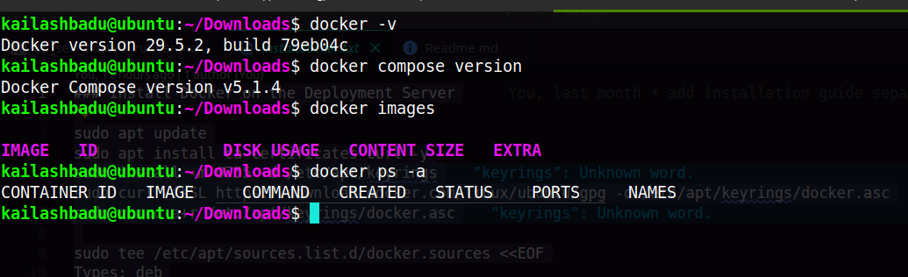


## Verify with verify hello-world.
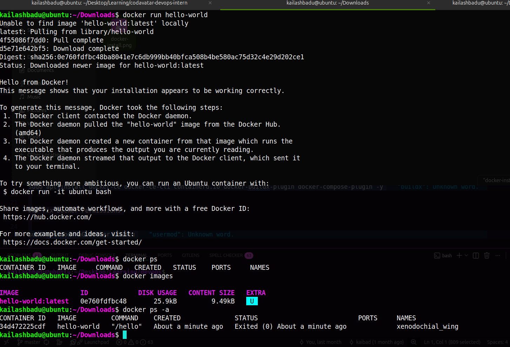


## Task 2: Build one custom Docker image using Dockerfile. and Run the image as a container with port mapping.

```Dockerfile
FROM node:20-alpine AS builder
WORKDIR /app
COPY package*.json .
RUN npm ci
COPY . .
RUN npm run build
RUN ls -lah /app/dist

FROM nginx:alpine
WORKDIR /app
COPY --from=builder /app/dist /usr/share/nginx/html
CMD ["nginx", "-g", "daemon off;"]
```

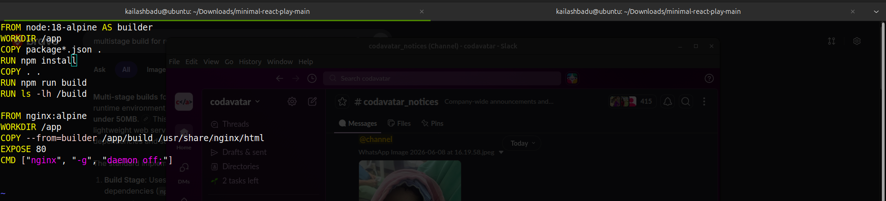

**docker build -t tictactoe .**
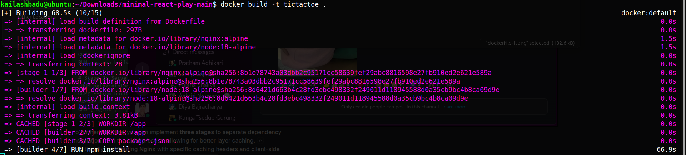

**Serve the application in the web using nginx**
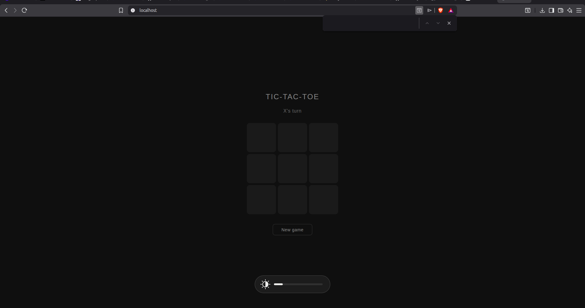

**Push to hub.docker.com**
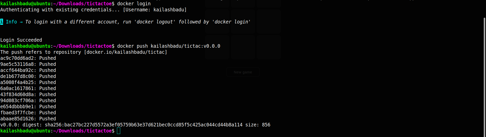


## Task 3: Use docker logs, docker ps, docker stop, and docker rm.

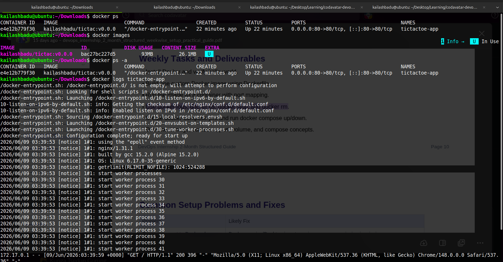
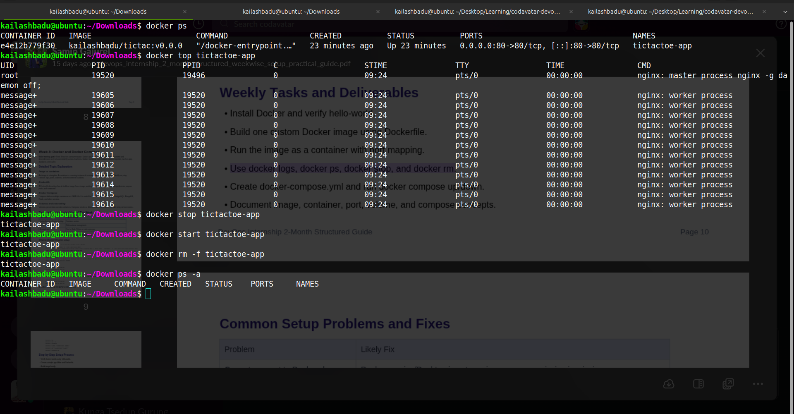


## Task 4: Create docker-compose.yml and run docker compose up/down.

```yaml
services:
  tictactoe:
    build:
      context: .
    container_name: tictac-app
    ports:
      - "80:80"
  postgres:
    image: postgres:16-alpine
    container_name: postgres-db
    restart: unless-stopped
    ports:
      - "5432:5432"
    environment:
      POSTGRES_USER: postgres
      POSTGRES_PASSWORD: postgres
      POSTGRES_DB: tictac-test
    volumes:
      - pgdata:/var/lib/postgresql/data

  pgadmin:
    image: dpage/pgadmin4
    container_name: pgadmin
    restart: unless-stopped
    ports:
      - "5050:80"
    environment:
      PGADMIN_DEFAULT_EMAIL: admin@admin.com
      PGADMIN_DEFAULT_PASSWORD: admin
    depends_on:
      - postgres

volumes:
  pgdata:

```
***docker-compose.yml***
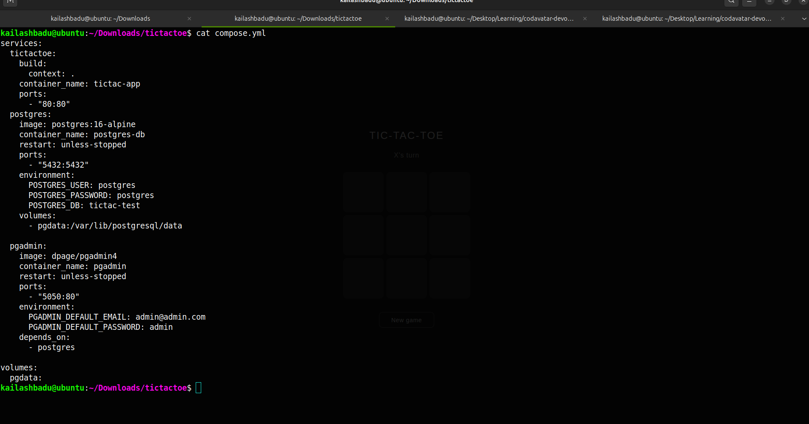

***docker compose up / docker compose down***

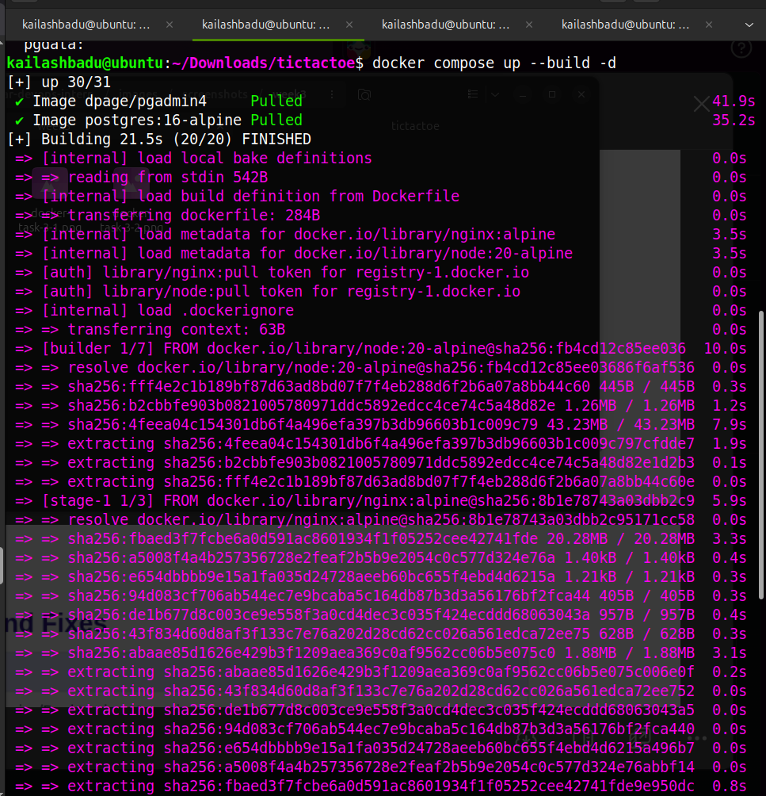
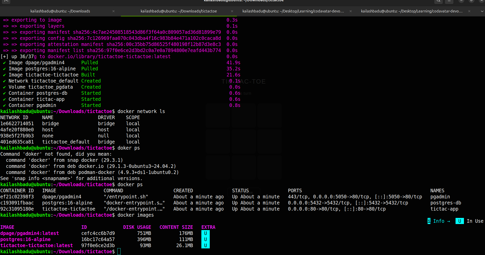
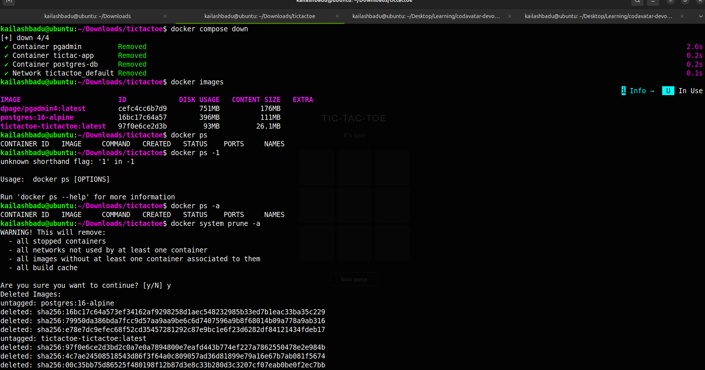

```bash

sudo ss -ltnp | grep 5432
# to check the port is taken or not
```
