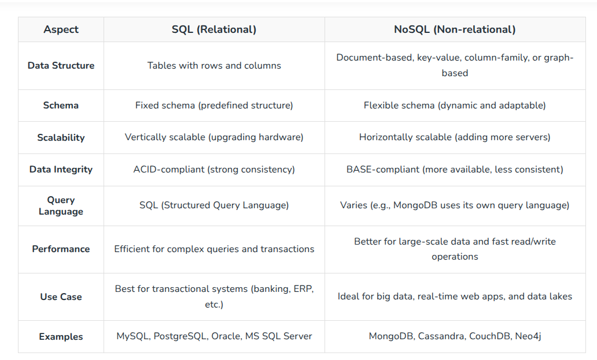
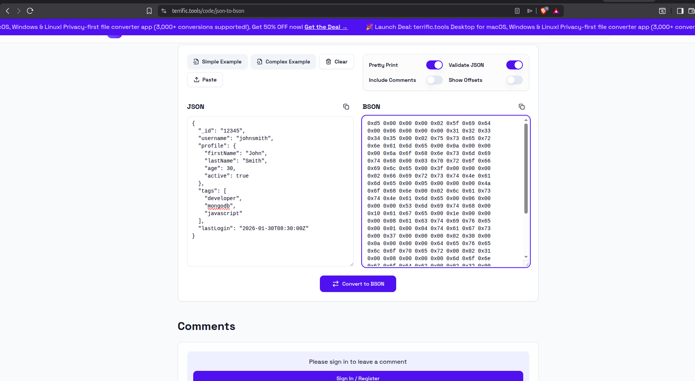

# What Is a Non-Relational Database?

Most databases can be categorized as either relational or non-relational. Non-relational databases are sometimes referred to as “NoSQL,” which stands for Not Only SQL. The main difference between these is how they store their information.

A non-relational database stores data in a non-tabular form, and tends to be more flexible than the traditional, SQL-based, relational database structures. It does not follow the relational model provided by traditional relational database management systems.

A relational database typically stores information in tables containing specific pieces and types of data. For example, a shop could store details of their customers’ names and addresses in one table and details of their orders in another. This form of data storage is often called structured data.

Relational databases use Structured Query Language (SQL). In relational database design, the database usually contains tables consisting of columns and rows. When new data is added, new records are inserted into existing tables or new tables are added. Relationships can then be made between two or more tables.

Relational databases work best when the data they contain doesn’t change very often, and when accuracy is crucial. Relational databases are, for instance, often found in financial applications.


**Non-relational databases** (often called NoSQL databases) are different from traditional relational databases in that they store their data in a non-tabular form. Instead, non-relational databases might be based on data structures like documents. A document can be highly detailed while containing a range of different types of information in different formats. This ability to digest and organize various types of information side by side makes non-relational databases much more flexible than relational databases.

## The benefits of a non-relational database

Today’s applications collect and store increasingly vast quantities of ever more complex customer and user data. The benefits of this data to businesses, of course, lie in their potential for analysis. Using a non-relational database can unlock patterns and value even within masses of variegated data.


### Massive dataset organization

In the age of Big Data, non-relational databases can not only store massive quantities of information, but they can also query these datasets with ease. Scale and speed are crucial advantages of non-relational databases.

### Flexible database expansion

Data is not static. As more information is collected, a non-relational database can absorb these new data points, enriching the existing database with new levels of granular value even if they don’t fit the data types of previously existing information.

### Multiple data structures

The data now collected from users takes on myriad forms, from numbers and strings, to photo and video content, to message histories. A database needs the ability to store these various information formats, understand relationships between them, and perform detailed queries. No matter what format your information is in, non-relational databases can collate different information types together in the same document.

### Built for the cloud

A non-relational database can be massive. And as they can, in some cases, grow exponentially, they need a hosting environment that can grow and expand with them. The cloud’s inherent scalability makes it an ideal home for non-relational databases.

---
## Difference between SQL and NoSQL

Choosing between SQL (Structured Query Language) and NoSQL (Not Only SQL) databases is a critical decision for developers, data engineers, and organizations looking to handle large datasets effectively. Both database types have their strengths and weaknesses, and understanding the key differences can help us make an informed decision based on our project's needs.



---

## MongoDB

MongoDB is a document database with the scalability and flexibility that you want with the querying and indexing that you need


As a NoSQL database solution, MongoDB does not require a relational database management system (RDBMS), so it provides an elastic data storage model that enables users to store and query multivariate data types with ease. This not only simplifies database management for developers but also creates a highly scalable environment for cross-platform applications and services.

MongoDB documents or collections of documents are the basic units of data. Formatted as Binary JSON (Java Script Object Notation), these documents can store various types of data and be distributed across multiple systems. Since MongoDB employs a dynamic schema design, users have unparalleled flexibility when creating data records, querying document collections through MongoDB aggregation and analyzing large amounts of information.


## DIff between Amazon DynamoDB and mongodb

| Feature           | DynamoDB                                       | MongoDB                                                                                          |
| ----------------- | ---------------------------------------------- | ------------------------------------------------------------------------------------------------ |
| Database Type     | Key-value + document                           | Document database                                                                                |
| Ownership         | AWS-managed service                            | Developed by [MongoDB Inc.](https://www.mongodb.com?utm_source=chatgpt.com)                      |
| Hosting           | Fully managed by AWS                           | Self-hosted or managed via [MongoDB Atlas](https://www.mongodb.com/atlas?utm_source=chatgpt.com) |
| Data Format       | Items with attributes                          | JSON-like BSON documents                                                                         |
| Query Flexibility | Optimized around primary keys and indexes      | Rich ad hoc queries and aggregations                                                             |
| Joins             | No traditional joins                           | Limited joins via `$lookup`                                                                      |
| Scaling           | Automatic and built-in                         | Supports sharding but requires more planning                                                     |
| Performance       | Extremely fast for predictable access patterns | Flexible but generally less optimized for key-value workloads                                    |
| Pricing Model     | Pay for throughput/storage                     | Pay for infrastructure/storage                                                                   |

## BSON

BSON is a binary encoded Javascript Object Notation (JSON)—a textual object notation widely used to transmit and store data across web based applications. JSON is easier to understand as it is human-readable, but compared to BSON, it supports fewer data types. BSON encodes type and length information, too, making it easier for machines to parse

```bson
{"hello": "world"} →
\x16\x00\x00\x00           // total document size
\x02                       // 0x02 = type String
hello\x00                  // field name
\x06\x00\x00\x00world\x00  // field value
\x00                       // 0x00 = type EOO ('end of object')
```

### How is BSON Different from JSON?

| Feature               | JSON                                                                                     | BSON                                                                                                                  |
| --------------------- | ---------------------------------------------------------------------------------------- | --------------------------------------------------------------------------------------------------------------------- |
| **Type**              | JSON (JavaScript Object Notation) is a **text-based** data format.                       | BSON (Binary JSON) is a **binary-encoded** data format.                                                               |
| **Speed**             | JSON is generally faster for humans to read and transmit because it is lightweight text. | BSON can be faster for databases because it stores data in a format optimized for scanning and processing.            |
| **Space**             | JSON usually uses less space because it only stores text values.                         | BSON can use more space because it stores additional metadata like type and length information.                       |
| **Encode and Decode** | JSON can be sent directly through APIs without additional encoding/decoding.             | BSON data is encoded before storage and decoded when retrieved.                                                       |
| **Parsing**           | JSON is human-readable and must be parsed by applications to convert into objects.       | BSON is machine-readable binary data and is parsed by databases for efficient processing.                             |
| **Data Types**        | JSON supports limited data types: **string, number, boolean, array, object, and null**.  | BSON supports JSON types plus additional types such as **Date, ObjectId, Decimal128, Binary Data, Int32, and Int64**. |
| **Usage**             | Mainly used for data exchange between applications, especially APIs and web services.    | Mainly used for database storage, especially in MongoDB.                                                              |
### Advantages of BSON

1. Lightweight and Traversable
2. Efficient
3. Handles Additional Data Types
4 Handles Additional Data Types : Bindata, Minkey, Maxkey, Binary Data, ObjectID, Regular Expression, JavaScript, Decimal128, and Date for datetime in BSON.



### How to Import and Export a BSON File in MongoDB

```bash
mongorestore -d db_name /path/file.bson # import
bsondump collection.bson #export
```

## Important Commands

### Create

```javascript
insertOne() // To insert a single document, use the insertOne() method.

insertMany() // To insert multiple documents at once, use the insertMany() method.

createCollection() 

```

### Read
```
find() // This method accepts a query object. If left empty, all documents will be returned.

findOne() // To select only one document, we can use the findOne() method

countDocuments() // countDocuments() is the recommended MongoDB method for returning an exact count of documents in a collection that match a specified query filter. 
```

### Update

```javascript
updateOne() // The updateOne() method will update the first document that is found matching the provided query.

updateMany() // The updateMany() method will update all documents that match the provided query.

$set updates a field to a specified value (e.g., strings, dates, or overwriting numbers).

$inc adds a specified amount to a numeric field; if the field does not exist, it creates it with that initial value
```

### Delete

```javascript
deleteOne() // The deleteOne() method will delete the first document that matches the query provided.

deleteMany() //The deleteMany() method will delete all documents that match the query provided.

drop() // To remove a specific collection and all its indexes, use the db.collection.drop() method.

db.myCollection.drop()
```


# REFERENCES

- https://www.mongodb.com/resources/basics/databases/non-relational
- Difference between SQL and NoSQL: https://www.geeksforgeeks.org/sql/difference-between-sql-and-nosql/
- What is MOngodb: https://www.mongodb.com/company/what-is-mongodb
- https://www.ibm.com/think/topics/mongodb
- bson: https://www.mongodb.com/resources/languages/bson
- health check for mongodb container: https://oneuptime.com/blog/post/2026-03-31-mongodb-docker-health-checks/view
- healthcheck: https://kevzpeter.com/blog/implementing-docker-compose-healthchecks
- heatlcheck: https://lumsx-bbb.lums.edu.pk/fast-dispatch/mongodb-docker-image-implementing-a-health-check-1764815265
- healthcheck: https://medium.com/@cbaah123/docker-compose-health-checks-made-easy-a-practical-guide-3a340571b88e
- mongodb docker compose: https://gist.github.com/maitrungduc1410/f2f7b34d2e736912471b006c6dba17e5
- web ui i.e mongo express: https://oneuptime.com/blog/post/2026-02-08-how-to-run-mongo-express-in-docker-for-mongodb-management/view

- https://www.w3schools.com/mongodb/
- Insert: https://www.w3schools.com/mongodb/mongodb_mongosh_insert.php
