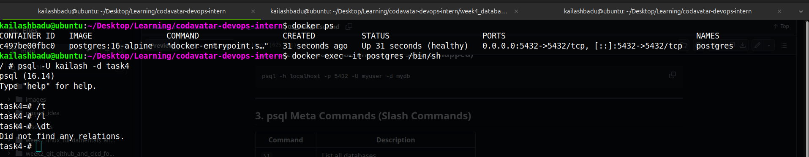
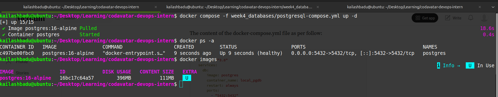
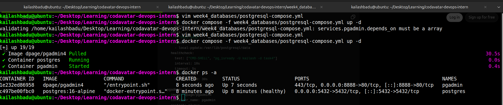
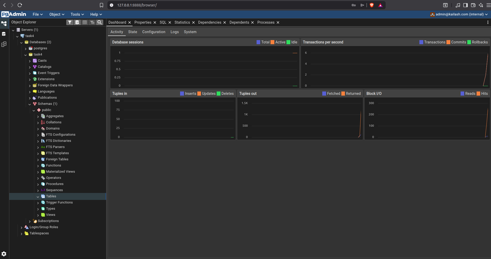
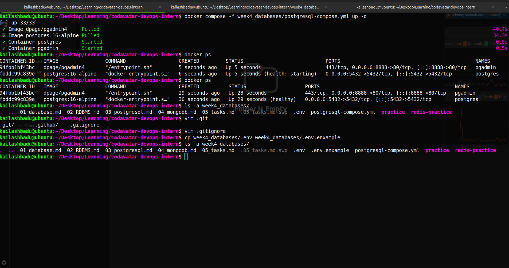

# 1. Run PostgreSQL using Docker Compose


```yml
services:
  postgres:
    image: postgres:16-alpine
    container_name: postgres
    restart: always
    environment:
      POSTGRES_DB: task4
      POSTGRES_USER: kailash
      POSTGRES_PASSWORD: kailash
    ports:
      - "5432:5432"
    volumes:
      - local-pgdata:/var/lib/postgresql/data
    healthcheck:
      test: ["CMD-SHELL","pg_isready -U kailash -d task4"]
      interval: 10s
      timeout: 5s
      retries: 5
      start_period: 30s

volumes:
  local-pgdata:


```

```bash
docker compose -f week4_databases/postgresql-compose.yml up -d
```





## Pgadmin

```yaml

services:
  postgres:
    image: postgres:16-alpine
    container_name: postgres
    restart: always
    environment:
      POSTGRES_DB: task4
      POSTGRES_USER: kailash
      POSTGRES_PASSWORD: kailash
    ports:
      - "5432:5432"
    volumes:
      - local-pgdata:/var/lib/postgresql/data
    healthcheck:
      test: ["CMD-SHELL","pg_isready -U kailash -d task4"]
      interval: 10s
      timeout: 5s
      retries: 5
      start_period: 30s

  pgadmin:
    image: dpage/pgadmin4
    container_name: pgadmin
    restart: always
    depends_on:
      - postgres
    ports:
      - "8888:80"
    environment:
      PGADMIN_DEFAULT_EMAIL: admin@kailash.com
      PGADMIN_DEFAULT_PASSWORD: pgpass


volumes:
  local-pgdata:
```
**connection anme** task4
**hostname** container name i.e postgres
**db name** task4
**username** kailash
**password** kailash




**pgadmin dashboard**



## using env vars in docker compose

```bash
vim week4_databases/.env


```

