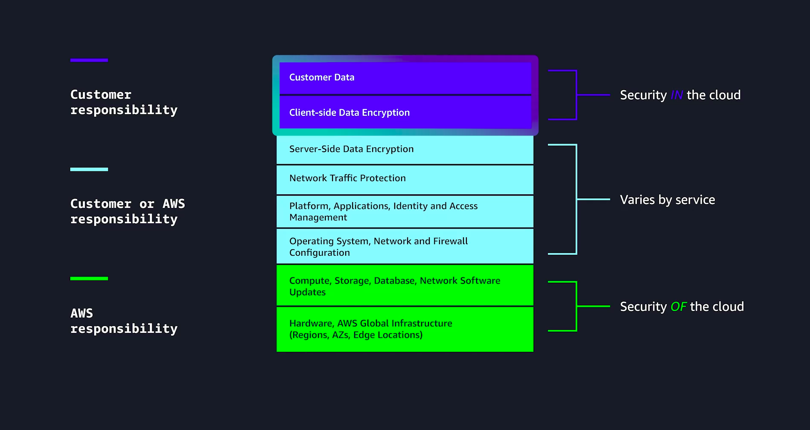
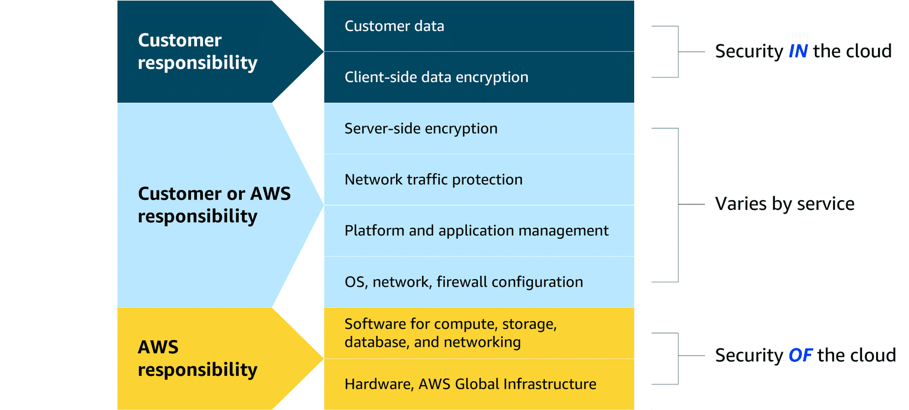
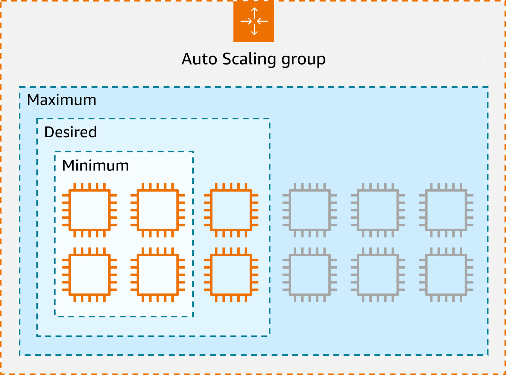
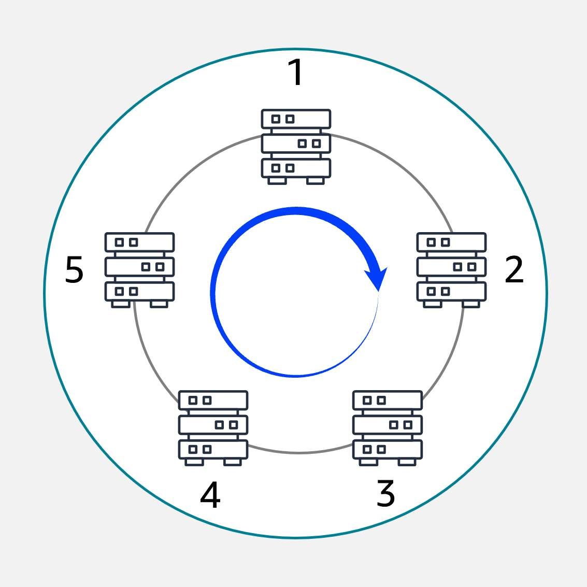
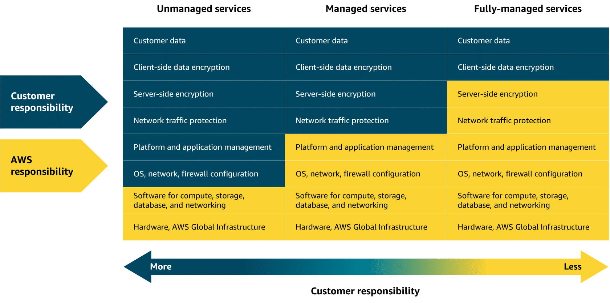

# Module 1: Introduction to Cloud

In this training, we use a coffee shop analogy to help you better understand basic cloud concepts. To explore the coffee shop and learn more about your instructors, choose each of the following four numbered markers.

In our coffee shop example, a barista and customer were used to represent the client-server model. The barista represents the server and a customer represents the client.

Which scenario BEST describes how the client-server model works in this analogy?

The customer goes to the barista and places an order for a coffee. The barista prepares the coffee and hands it back to the customer. This describes how the client places the request, and the server responds.

## What is Cloud Computing?

Cloud computing is essentially the on-demand delivery of IT resources over the internet with pay-as-you-go pricing. Shall we break this down a bit? I think we shall. On demand means you use resources as needed. Let's say your business needs 2,000 TB of storage. Open an AWS account, throw some files into Amazon S3, and Bob’s your uncle. You're good to go. If you don't need to store those files anymore? Delete them, and stop paying immediately.

The idea of the delivery of these on-demand IT resources, as you learned, is the concept that got AWS started in the first place. Let's say you have an application that you have to run, content you need stored, or data you need analyzed. Basically, you have stuff that uses IT resources that have to live and operate somewhere. All of that data is stored in a data center, which is essentially a building or set of buildings devoted to housing servers that contain all this data. Data centers are designed with redundant power, cooling, and security measures to ensure secure and continuous operation. Historically, businesses would run applications in their own data centers or co-locate with other customers in a shared facility. There was no alternative. Once AWS became available, companies could now run their applications in other data centers they didn't actually own. No more infrastructure to manage. No more repetitive tasks and time-consuming ones--goodbye. By using AWS, teams could now focus on innovation.

Oh, and the over-the-internet part means you can access those resources remotely. You can be in your house, place of business, or visiting family around the world. Hi Mom! In fact, all you need is an internet connection. Log into your AWS Account and manage your infrastructure right from your web-browser.

And with pay-as-you-go pricing, if you don’t need a particular part of your infrastructure, just deprovision it. Simple as that. No contracts. No need to call a sales rep.

To reiterate: cloud computing is the on-demand delivery of IT resources over the internet with pay-as-you-go pricing. So, as you tackle the rest of this content, keep this definition in mind. Happy learning!

---

## History of cloud computing and AWS

Before we dive into cloud computing, let's rewind the clock and set some context for how Amazon grew to include Amazon Web Services. In the early 2000s, Amazon.com was an ecommerce site that customers used to buy books and other consumer goods. As more people started to use the site, the Amazon IT team had to continually make upgrades to keep things running smoothly. More servers, more storage, more compute. You name it. They were deploying it!

The team eventually decided to develop various standardized tools, mechanisms, and ways to make things more efficient and scalable. These methods proved to be quite effective, and in 2003, employees thought, "Maybe this knowledge would be valuable to other companies facing similar challenges." Thus, Amazon started to envision a service that would allow businesses to rent computing power, storage, and other resources, on-demand. This business model could eliminate the need for upfront investment in hardware.

Just a year later, in November 2004, AWS launched its first public infrastructure service: Amazon Simple Queue Service. Two years later, AWS launched Amazon Simple Storage Service for data storage and Amazon Elastic Compute Cloud for scalable compute. Initially, AWS was used by smaller start-ups and developers. However, its scalability, cost-effectiveness, and ease of use quickly attracted larger enterprises.

Over the next few years, AWS rapidly expanded its offerings by adding databases, networking, analytics, and many other cloud-based services. Fast forward to the present. AWS powers a significant portion of the internet, serving millions of customers worldwide. From small start-ups and businesses, to large corporations, government agencies, and more. What started as an internal solution for Amazon's own IT needs has grown into a global cloud computing leader.

---

## Cloud deployment types

You can deploy cloud resources in multiple ways: cloud, on-premises, and hybrid. Each type offers unique benefits and considerations, and exploring these options can help you make informed decisions about your cloud strategy. To learn more about cloud deployment types, choose each of the following flashcards.

### Cloud

In a cloud-based deployment model, you have the flexibility to migrate your existing resources to the cloud, design and build new applications within the cloud environment, or use a combination of both.

For instance, a company might migrate data resources to the cloud, then develop an application comprised of virtual servers, databases, and networking components entirely hosted in the cloud.

### ON premises

Deploying resources on premises using virtualization and resource management tools does not provide many of the benefits of cloud computing. However, it is sometimes sought for its ability to provide dedicated resources and low latency.

In most cases this deployment model is the same as legacy IT infrastructure while using application management and virtualization technologies to try increasing resource utilization.

### Hybrid Deployment

In a hybrid deployment, cloud-based resources and on-premises infrastructure work together. This approach is ideal for situations where legacy applications must remain on premises due to maintenance preferences or regulatory requirements.

For instance, a company might choose to retain certain regulated legacy applications on-premises while using cloud services for advanced data processing and analytics.

Multi-cloud deployments can also be considered hybrid deployments.

---

## Benefits of AWS cloud

The six key benefits of the AWS Cloud are as follows.

### 1. Trade fixed expense for variable expense

By using the AWS Cloud, businesses can transition from fixed investments to variable costs. With variable costs, customer expenses are better aligned with actual usage, thus creating more financial flexibility.

### Benefit from massive economies of scale

Like buying a product in bulk can result in lower prices per unit, the vast global infrastructure of AWS can result in lower costs for customers. This means that AWS can be used by many organizations, from small startups to major corporations. Businesses big and small can access advanced technologies that were previously only accessible to large enterprises.

### Stop guessing capacity

Customers can dynamically scale AWS Cloud resources up or down based on real-time demand. This means businesses can achieve optimal performance without provisioning more or less infrastructure than they need.

### Increase speed and agility

With the cloud, businesses can rapidly deploy applications and services, accelerating time to market and facilitating quicker responses to changing business needs and market conditions.

### Stop spending money to run and maintain data centers

The AWS Cloud eliminates the need for businesses to invest in physical data centers. This means customers aren't required to spend time and money on utilities and ongoing maintenance. With AWS taking care of the physical infrastructure of the cloud, customer resources can be reallocated to more strategic initiatives.

### Go global in minutes

Businesses don't need to set up their own infrastructure to expand internationally. AWS provides a robust global infrastructure that customers can use to deploy applications and services across multiple areas in minutes.

### Test

A retail business plans to launch a new line of clothing, but they are struggling with accurately predicting how much server capacity they will need to support the launch.

Which benefit of the AWS Cloud is most relevant to this situation?  
Stop guessing capacity.

---

## Introduction to AWS Global Infrastructure

High Availability

To learn a little bit more about high availability, let's head back to our coffee shop. Say you've hired a new employee, and they're learning how to make a latte. They're doing awesome. They've got the right milk-to-espresso ratio, and they are even making some cool designs with their latte pour—until they miss the cup and they pour the latte all over the register. That is not good. The register is now fried, and it seems like it shorted the electricity everywhere in the shop. Yikes! That means we can't ring up the orders or make drinks for our customers. We're gonna have to close up shop until this is sorted out.

AWS has a similar set up with our global infrastructure. It's risky to have one giant data center where all of the resources are housed. If something were to happen to that data center, like a power outage or a natural disaster, everyone's applications would go down all at once. You need high availability and fault tolerance. Let’s clarify those terms. High availability is all about making sure your applications stay accessible with minimal downtime. Even if one component fails, another is ready to pick up the slack so your service keeps running.

Fault tolerance takes it a step further by designing a system to continue to operate even if multiple components fail. It’s basically building resilience into every layer so that no one single failure brings down the whole system. Designing for high availability and fault tolerance is part of the reason why AWS operates in Regions, which are located in different areas around the world. These Regions are built to be as close to AWS customers as possible. This includes locations like Paris, Tokyo, Sao Paulo, Dublin, or Ohio.

Within each Region, we have what we call Availability Zones, or AZs. There are three or more AZs within a Region, for redundancy. We don't build AZs right next to each other, because if something like a natural disaster were to occur, you could lose connectivity to everything in that AZ. And continuing with the theme of redundancy, within each AZ, there is one or more discrete data centers with redundant power, networking, and connectivity.

So, if a Region is where all the pieces and parts of your application live, some of you might be thinking that we never actually solved the problem that we presented earlier. If my business needs to be disaster proof, then it can't run in just one location. Well, you're absolutely correct. That's why it's common for businesses to operate across multiple Regions. That way, if one Region is experiencing outages for any reason, the operations can failover to another Region...but we'll cover that in more depth in a later lesson.

---

## The AWS Shared Responsibility Model

The AWS Shared Responsibility Model is a concept designed to help AWS and customers work together to create a secure, functional cloud environment. I

AWS = SECUIRTY OF THE CLOUD

CUSTOMERR = SECURITY IN THE CLOUD

You work for a startup company that is developing an application in the cloud. A new security update is available for your operating system (OS), and you are tasked with verifying that the OS is patched accordingly.

Which statement BEST describes which party is responsible for applying security patches to the OS that is running in the cloud?

Your company is responsible applying security patches to the OS.

---

# Module 2: Compute in the Cloud

Compute refers to the processing power needed to run applications, manage data, and perform calculations. In the cloud, this power is available on-demand. You can access it remotely without owning or maintaining physical hardware. Essentially, compute in the cloud means creating virtual machines with a cloud provider to run applications and tasks over the internet. Amazon Elastic Compute Cloud (Amazon EC2), a powerful compute service from AWS, as you explore its flexibility, cost-effectiveness, and scalability.

## Introduction to Amazon EC2

EC2 instances are virtual machines, or VMs. VMs share an underlying physical host machine with multiple other instances, which is a concept called multi-tenancy. In a multi-tenant environment, you need to make sure that each VM is isolated from each other but is still able to share resources provided by the host.

This job of resource sharing and isolation is being done by a piece of software called a hypervisor, which is running on the host machine. For EC2, AWS manages the underlying host, the hypervisor, and the isolation from instance to instance. So, even though you won't be managing this piece, it's important to have a basic grasp of the concept of multi-tenancy.

When you provision an EC2 instance, you can choose the operating system, or OS, based on either Windows or Linux. You can provision thousands of EC2 instances on demand, with a blend of operating systems and configurations to power your business' different applications.

Amazon EC2 is more flexible, cost-effective, and faster than managing on-premises servers. It offers on-demand compute capacity that can be quickly launched, scaled, and terminated, with costs based only on active usage.

The flexibility of Amazon EC2 allows for faster development and deployment of applications. You can launch as many or as few virtual servers as needed and configure security, networking, and storage. You can also scale resources up or down based on usage, such as handling high traffic or compute-heavy tasks.

### Challenges of on-premises resources

Imagine that you're responsible for designing your company's infrastructure to support new websites. With traditional on-premises resources, you must purchase hardware upfront, wait for delivery, and handle installation and configuration. This process is time-consuming, costly, and inflexible because you're locked into a specific capacity that might not align with changing demands.

### Benefits of using Cloud Resources

In contrast, with Amazon EC2, you can quickly launch, scale, and stop instances based on your needs without the delays and upfront costs associated with traditional on-premises resources.

### How Amazon EC2 works

- Launch an instance
- Connect to the instance
- Use the instance

## EC2 instance types

### General Purpose

General purpose instances provide a balanced mix of compute, memory, and networking resources. They are ideal for diverse workloads, like web services, code repositories, and when workload performance is uncertain.

### Compute optimized
Compute optimized instances are ideal for compute-intensive tasks, such as gaming servers, high performance computing (HPC), machine learning, and scientific modeling.

### Memory optimized
Memory optimized instances are used for memory-intensive tasks like processing large datasets, data analytics, and databases. They provide fast performance for memory-heavy workloads.

### Accelerated Optimized
Accelerated computing instances use hardware accelerators, like graphics processing units (GPUs), to efficiently handle tasks, such as floating-point calculations, graphics processing, and machine learning.

### Storage Optimized

Storage optimized instances are designed for workloads that require high performance for locally stored data, such as large databases, data warehousing, and I/O-intensive applications.

### Interacting with AWS services

All interactions with services are powered by APIs. You can access these APIs through three primary methods: the AWS Management Console, the AWS CLI, or the AWS SDK. Let's review these methods.

### Launching an Amazon EC2 Instance

**Amazon Machine Images** An AMI includes the operating system, storage setup, architecture type, permissions for launching, and any extra software that is already installed. You can use one AMI to launch several EC2 instances that all have the same setup.

An AMI is a pre-configured virtual machine image that contains the operating system, application server, and applications. This helps to launch EC2 instances quickly with the desired software and settings.

To launch an EC2 instance for a web server, configure the AMI to define the operating system and software; select the instance type to allocate CPU, memory, and storage; and set up storage options, including the type and size of the volume.

Load balancing, permissions, and instance termination behavior are not required when launching a basic Amazon EC2 web server.

### Dedicated hosts vs dedicated instases
Dedicated Hosts provide exclusive use of a physical server, providing full control over placement and resource allocation. This is ideal for security-sensitive and licensing-specific workloads.

Spot Instances offer up to 90 percent off On-Demand pricing, making them the most cost-effective option for workloads that can tolerate interruptions.

Reserved Instances require a 1-year or 3-year commitment, which is not suitable for a new application with unpredictable usage.

On-Demand pricing is ideal for starting without commitment. The customer can test and adjust based on actual usage before committing to longer-term options.

--- 
## Scaling Amazon EC2

**Scalability** refers to the ability of a system to handle an increased load by adding resources. You can scale up by adding more power to existing machines, or you can scale out by adding more machines. Scalability focuses on long-term capacity planning to make sure that the system can grow and accommodate more users or workloads as needed.

**Elasticity** is the ability to automatically scale resources up or down in response to real-time demand. A system can then rapidly adjust its resources, scaling out during periods of high demand and scaling in when the demand decreases. Elasticity provides cost efficiency and optimal resource usage at any given moment.

### Amazon EC2 Auto Scaling

Amazon EC2 Auto Scaling automatically adjusts the number of EC2 instances based on changes in application demand, providing better availability. It offers two approaches. Dynamic scaling adjusts in real time to fluctuations in demand. Predictive scaling preemptively schedules the right number of instances based on anticipated demand.

An Auto Scaling group is configured with the following three key settings.

**Minimum capcity** The minimum capacity defines the least number of EC2 instances required to keep the application running. This makes sure that the system never scales below this threshold. It's the number of EC2 instances that launch immediately after you have created the Auto Scaling group. 

**Desired Capacity** The desired capacity is the ideal number of instances needed to handle the current workload, which Auto Scaling aims to maintain. If you do not specify the desired number of EC2 instances in an Auto Scaling group, the desired capacity defaults to your minimum capacity.

**Maximum Capacity** The maximum capacity sets an upper limit on the number of instances that can be launched, preventing over-scaling and controlling costs. For example, you might configure the Auto Scaling group to scale out in response to increased demand.

---

## Directing Traffic with Elastic Load Balancing

Spreading workloads improves the performance of your applications by preventing any single resource from having to handle the full workload on its own. In this lesson, you will learn how ELB simplifies traffic distribution and management for AWS applications.

### Elastic Load Balancing

Elastic Load Balancing (ELB) automatically distributes incoming application traffic across multiple resources, such as EC2 instances, to optimize performance and reliability. A load balancer serves as the single point of contact for all incoming web traffic to an Auto Scaling group. As the number of EC2 instances fluctuates in response to traffic demands, incoming requests are first directed to the load balancer. From there, the traffic is distributed evenly across the available instances.
    
Although ELB and Amazon EC2 Auto Scaling are distinct services, they work in tandem to enhance application performance and ensure high availability. Together, they enable applications running on Amazon EC2 to scale effectively while maintaining consistent performance.

ELB improves scalability by automatically distributing traffic to the EC2 instances with the least load, resulting in efficient traffic management. ELB scales elastically. This means it adjusts traffic routing based on demand without increasing hourly costs, which is a key benefit.

### Routing methods

To optimize traffic distribution, ELB uses several routing methods: Round Robin, Least Connections, IP Hash, and Least Response Time. These routing strategies work together for efficient traffic management and optimal application performance.

<table>
<tr>
<td width="50%">
**Round Robin**

Distributes traffic evenly across all available servers in a cyclic manner.

</td>

<td width="50%">

</td>
</tr>
</table>

<table>
<tr>

<td width="50%">

</td>
<td width="50%">
**Least Connections**
Routes traffic to the server with the fewest active connections, maintaining a balanced load.
</td>

</tr>
</table>

<table>
<tr>
<td width="50%">
**IP Hash**
Uses the client’s IP address to consistently route traffic to the same server.
</td>

<td width="50%">

</td>
</tr>
</table>

<table>
<tr>

<td width="50%">

</td>
<td width="50%">
**Least Response Time**

Directs traffic to the server with the fastest response time, minimizing latency.
</td>

</tr>
</table>

---

## Exploring Compute Services

### Introduction to Serverless Computing

With serverless computing, you run applications without managing the underlying infrastructure. In the following lessons, you learn how to take full advantage of it with powerful compute services. You explore AWS Lambda, a serverless solution that automatically handles scaling, availability, and maintenance. You also discover services like Amazon Elastic Container Service (Amazon ECS), Amazon Elastic Kubernetes Service (Amazon EKS), and AWS Elastic Beanstalk, which make container management and application deployment more manageable. After completing these lessons, you will be ready to choose the best one for your needs.

### Unmanaged and managed services

AWS offers both unmanaged and managed services to suit different levels of control and responsibility. By understanding this model, you will know which tasks AWS manages and which you are responsible for, helping you secure and manage your cloud resources effectively.

**Unmanaged and managed services**

With unmanaged compute services like Amazon EC2, AWS takes care of the underlying physical infrastructure, but you're responsible for setting up, securing, and maintaining the operating system, network configurations, and applications on your instances. Managed services, on the other hand, reduce the amount of infrastructure you need to manage. While AWS handles much of the operational overhead, you might still need to perform some provisioning or configuration depending on the service.

**Fully-managed services**

Fully-managed services—like serverless ones—take abstraction even further, eliminating the need to provision or manage any servers at all. The underlying infrastructure is fully managed by AWS, so you can focus entirely on writing and deploying code. Later in this module, you will explore Lambda. Lambda is a serverless compute service where AWS handles the infrastructure, scaling, and availability, while you remain responsible for securing and managing your application code.

With unmanaged services like Amazon EC2, you set up and manage everything: the operating system, security updates, and network settings. AWS only takes care of the physical hardware. Managed services handle most of the infrastructure for you, but you still need to set up things like deployment options, scaling, and environment settings. With fully managed services like AWS Lambda, you don’t manage any servers at all. You upload your code, and AWS takes care of the rest, including infrastructure, scaling, and availability. 

---
### AWS Lambda

Lambda is a serverless compute service that runs code in response to events without the need to provision or manage servers. It automatically manages the underlying infrastructure, scaling resources based on the volume of requests. You are charged only for the compute time consumed, down to the millisecond. Lambda handles execution, scaling, and resource allocation. You can optimize performance by configuring the appropriate memory size for your function.

### Lambda use cases

Lambda is ideal for building responsive, event-driven applications across a wide range of industries. Here are three real-world examples that show how Lambda helps companies scale efficiently, reduce operational overhead, and only pay for what they use.

**Real-time image processing for a social media application** A social media company uses Lambda to process images uploaded by users. When a photo is uploaded, Lambda is triggered to resize the image, apply filters, and save it in an optimized format to storage. This event-driven, serverless approach makes sure that the application can handle high volumes of uploads without needing to manage infrastructure. Why Lambda: It automatically scales based on uploads and charges only for the time spent processing each image.

**Personalized content delivery for a news aggregator** A news aggregator uses Lambda to fetch and process news articles from multiple sources, then it tailors recommendations based on user preferences. When a user opens the application or performs a search, Lambda functions are triggered to retrieve data, run personalization logic, and return relevant content. Why Lambda: It automatically scales with user traffic and reduces costs by running code only when users interact.

**Real time event handling for an online game** A gaming company uses Lambda to handle in-game events like player actions, game state changes, and real-time leader board updates. Each event (like scoring a point or unlocking an achievement) triggers a Lambda function that updates player data and game status. Why Lambda: It handles thousands of events, in real-time, with no need to manage servers. Costs scale with usage, which is ideal for peak gaming times.

The key components of AWS Lambda are the function, triggers, and runtimes. These components handle code, respond to events, and provide the language environment. Customers do not need to manage servers, scaling, or operating systems. AWS takes care of all that.

---

# REFERENCES

https://skillbuilder.aws/learn/94T2BEN85A/aws-cloud-practitioner-essentials/8D79F3AVR7
- https://youtu.be/AgOmeANl3ls?si=JBdmb5v2d-I8YSST
