# Week 5: AWS Deployment: EC2, SSH, Docker on Server, and S3

## Overview

Week 5 moves from local machine to actual cloud infrastructure. The goal was to deploy a Dockerized app on an AWS EC2 instance, connect to it via SSH, configure security groups, and understand S3 as a separate object storage service. This week bridges everything from the previous weeks — Docker, networking, and Linux — into a real cloud deployment scenario.

---

## 1. AWS EC2: What It Is and Why We Use It

EC2 (Elastic Compute Cloud) is a virtual machine running in AWS's data center. Instead of buying physical hardware, you rent compute power by the hour. For deployments, EC2 acts as the server where your application actually runs.

Key concepts to know:

- **AMI (Amazon Machine Image)**: the OS template used to launch the instance (i used Ubuntu LTS)
- **Instance type**: defines CPU and RAM (used `t2.micro` which is free-tier eligible)
- **Key pair**: a `.pem` file that acts as your SSH password. AWS keeps the public key, we keep the private key
- **Public IP**: the IP address exposed to the internet, used to SSH in and access the app from a browser
- **Security group**: the firewall that controls which ports are open and from where

### Why EC2?

Running apps on your local machine only works for you. EC2 gives the app a public IP so anyone can reach it. It also simulates real production infrastructure,  most DevOps work involves managing servers like this.

### Steps

1. Sign in to AWS Console
2. Navigate to EC2
3. Launch an Instance
    - Click **Launch Instance**.
    - Enter a name for your instance.
    - Choose an Amazon Machine Image (AMI)
    - Choose an Instance Type
    - Configure Key Pair
    - Configure Network Settings
    - Configure Storage
    - Review and Launch
4. Verify Instance Status

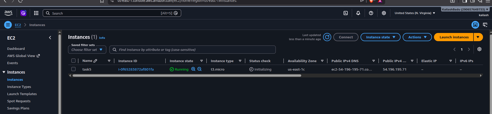

---

## 2. Security Group: The Firewall

A security group is a virtual firewall attached to your EC2 instance. By default, everything is blocked. You explicitly open ports based on what your app needs.

| Port | Protocol | Purpose |
|------|----------|---------|
| 22 | TCP | SSH — remote terminal access |
| 80 | TCP | HTTP — web app access from browser |
| 443 | TCP | HTTPS — secure web traffic |
| Custom | TCP | Any app-specific port (e.g., 3000, 8080) |

**Why we set inbound rules carefully:** Opening all ports to `0.0.0.0/0` is a security risk. In production, port 22 should be restricted to your IP only. For this lab, we opened 22 and 80 to allow SSH and browser access.

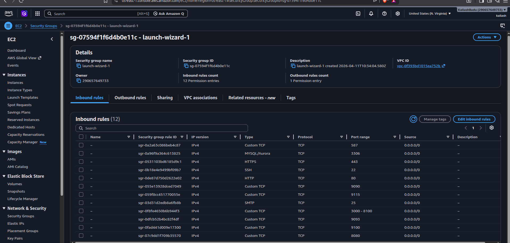

---

## 3. SSH: Connecting to the Server

SSH (Secure Shell) lets you control a remote Linux server from your terminal as if you were sitting in front of it. AWS uses key-based authentication instead of passwords — more secure and standard in cloud environments.

### Steps

**1. Set correct permissions on the key file**

AWS requires the private key file to be read-only by owner. Without this, SSH refuses to connect.

```bash
chmod 400 server.pem
```

the reason for runnig this is is to ensure that only the file owner can read the private key, and nobody else can read, write, or execute it.

Private keys are sensitive credentials. If other users on the system can read the key, they could use it to access your server.

When OpenSSH detects that a private key is accessible by other users, it refuses to use it and shows an error similar to:

```bash
WARNING: UNPROTECTED PRIVATE KEY FILE!
Permissions 0644 for 'server.pem' are too open.
It is required that your private key files are NOT accessible by others.
This private key will be ignored.
```

**Other Acceptable Permissions** is 600

**security principle** The .pem file contains your private SSH key, which acts like a password (and often provides stronger authentication than a password). Restricting it to the owner follows the principle of least privilege and prevents unauthorized access if the machine is shared.

**2. SSH into the EC2 instance**

```bash
ssh -i server.pem ubuntu@EC2_PUBLIC_IP

ssh -i server.pem ubuntu@54.123.45.67 -o StrictHostKeyChecking=no

# host key verification prompt (common for testing environments
```

- `-i devops-key.pem`: specifies the private key
- `ubuntu`: default username for Ubuntu AMIs
- `EC2_PUBLIC_IP`: the public IP from your EC2 console

**Why key-based auth?** Passwords can be brute-forced. Key pairs are cryptographically secure, the private key never leaves your machine.

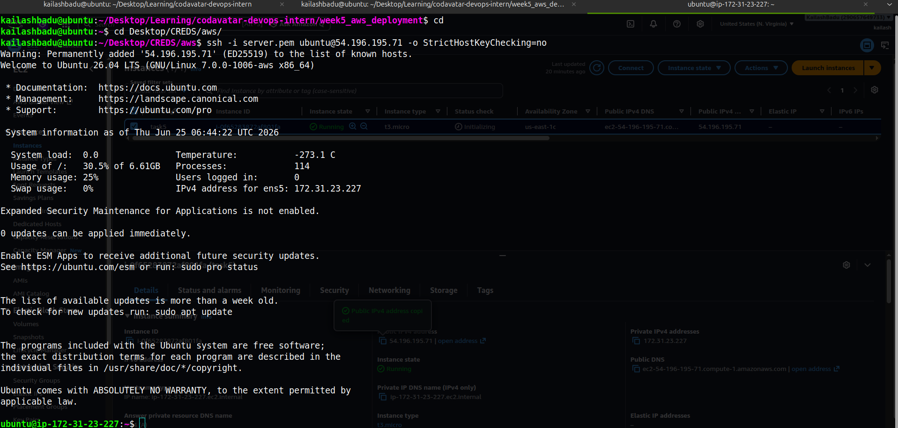

**another way to connect to a ec2 instance are**

1. connect ec2 from ec2 instace connect in browser
2. copy your local machine public key `cat .ssh/id_ed25519.pub`
3. paste it to aws ec2 instance's `authorized_key`. `vim ~/.ssh/authorized_key`

and then we can ssh into the ssh into that ec2 instance
   
---

## 4. Installing Docker on EC2

The EC2 instance is a fresh Ubuntu server  nothing is installed by default. We install Docker the same way we would on any Ubuntu machine.

```bash
### Install Docker on the Deployment Server

sudo apt update

sudo apt install ca-certificates curl -y
sudo install -m 0755 -d /etc/apt/keyrings
sudo curl -fsSL https://download.docker.com/linux/ubuntu/gpg -o /etc/apt/keyrings/docker.asc
sudo chmod a+r /etc/apt/keyrings/docker.asc

sudo tee /etc/apt/sources.list.d/docker.sources <<EOF
Types: deb
URIs: https://download.docker.com/linux/ubuntu
Suites: $(. /etc/os-release && echo "${UBUNTU_CODENAME:-$VERSION_CODENAME}")
Components: stable
Architectures: $(dpkg --print-architecture)
Signed-By: /etc/apt/keyrings/docker.asc
EOF

sudo apt update
sudo apt install docker-ce docker-ce-cli containerd.io docker-buildx-plugin docker-compose-plugin -y

### Fix Docker Permissions
sudo usermod -aG docker ubuntu

### Apply Changes
newgrp docker

# Verify
docker --version
docker compose version
```

**Why Docker on EC2?** Instead of manually installing Node, Python, Nginx, or any other dependencies on the server, we ship the app as a container image. The server only needs Docker — everything else is bundled inside the image. This makes deployments consistent and reproducible.

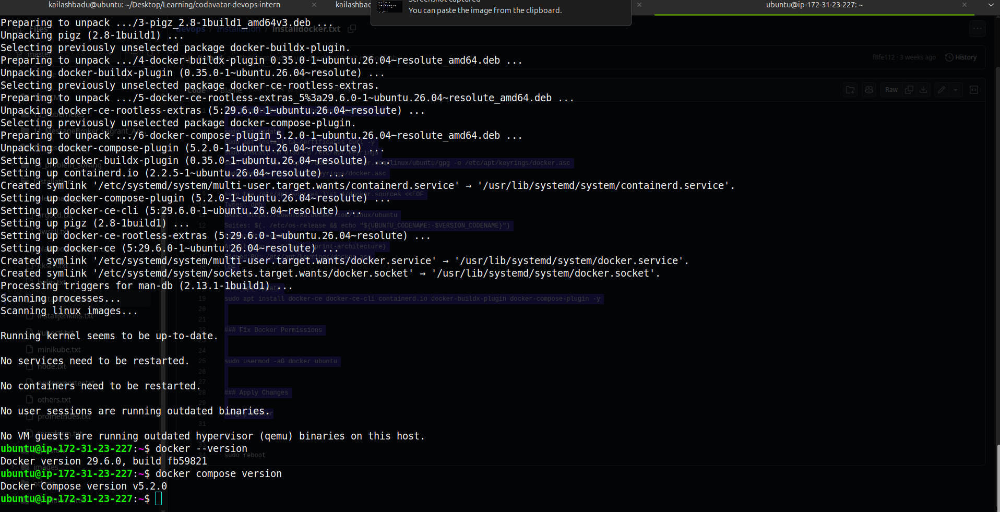

---

## 5. Deploying the Next js App on EC2

With Docker installed, we pulled the app from GitHub and ran it on the server.

```bash
# Clone the repo
https://github.com/404bad/devopscart.git

# Go to the  directory
cd devopscart

# Build the image
docker build -t devopscart:v1.0.0 .

# Run the container, expose port 80
docker run -d -p 80:3000 --name devopscart devopscart:v1.0.
0
# Verify it's running
docker ps

# Check logs
docker logs devopscart
```

Then from a local browser:

```
http://EC2_PUBLIC_IP
```

**How it works end-to-end:**
1. Docker builds the image from the `Dockerfile` in the repo
2. The container starts and listens on port 80 inside the container
3. `-p 80:3000` maps EC2's port 80 to the container's port 800
4. The security group allows traffic on port 80 from the internet
5. Browser hits the public IP on port 80, reaches the container, gets the response

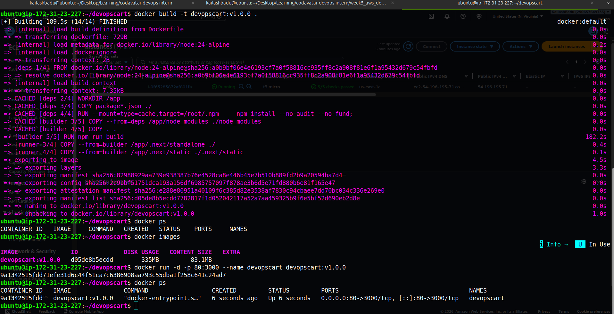

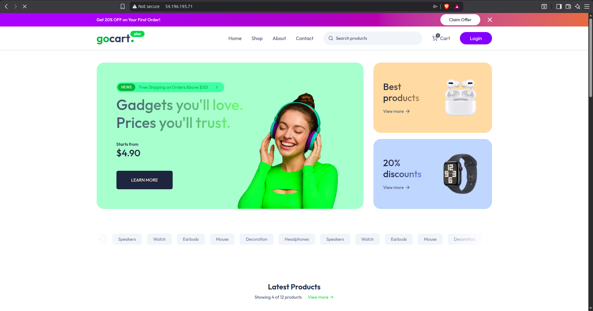

---

## 6. AWS CLI Setup

The AWS CLI lets you manage AWS resources from the terminal, creating buckets, listing objects, uploading files, and more  without needing to click through the console.

```bash
# Install on Linux x86_64
curl "https://awscli.amazonaws.com/awscli-exe-linux-x86_64.zip" -o "awscliv2.zip"
unzip awscliv2.zip
sudo ./aws/install

sudo apt install unzip

# Verify
aws --version

# Configure with credentials from trainer/admin
aws configure
```
we need to create the access key from the IAM.

`aws configure` prompts for:
- AWS Access Key ID
- AWS Secret Access Key
- Default region (e.g., `us-east-1`)
- Output format (`json`)

**Why CLI over Console?** The console is good for learning and one-off tasks. In real DevOps work, you automate things with CLI or scripts — the console doesn't scale.

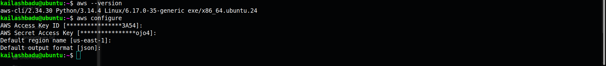
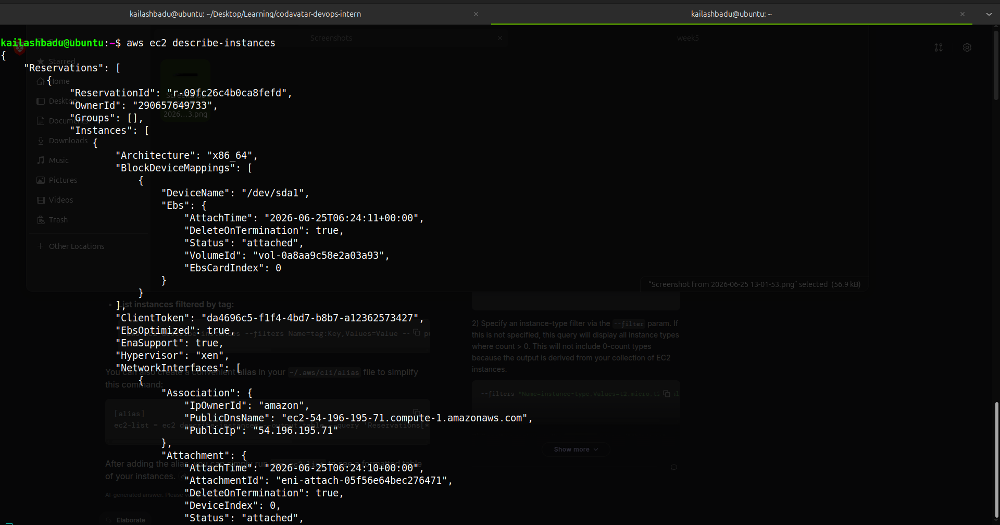

---

## 7. Create S3 bucket and upload one sample file using AWS Console or CLI.

S3 (Simple Storage Service) is AWS's object storage. Unlike EC2 which is compute, S3 is just a place to store files like images, backups, logs, static assets, anything. We  access objects via a URL, not a filesystem path.

Key concepts:
- **Bucket**: a container for objects, globally unique name required
- **Object**: a file stored in a bucket (can be any type, any size up to 5TB)
- **Region**: where the bucket physically lives
- **Permissions**: public vs private access; default is private

**Why S3 is separate from EC2?** Storage and compute are intentionally decoupled. If your EC2 instance crashes, files on EC2's disk are lost. S3 is independently managed, redundant, and durable (99.999999999% durability). Logs, user uploads, and backups should always go to S3, not the server disk.

### Creating a Bucket and Uploading a File
1. Variables (set once, reuse everywhere)

```bash
export BUCKET="shophive-frontend-dev"
export REGION="us-east-1"
```
2. Create the bucket

```bash
aws s3api create-bucket --bucket $BUCKET --region $REGION
```

3. Disable Block Public Access
```bash
aws s3api put-public-access-block --bucket $BUCKET  --public-access-block-configuration   "BlockPublicAcls=false,IgnorePublicAcls=false,BlockPublicPolicy=false,RestrictPublicBuckets=false"
```

4. Attach bucket policy (public read)
```bash
aws s3api put-bucket-policy --bucket $BUCKET --policy '{
    "Version": "2012-10-17",
    "Statement": [{
      "Sid": "PublicReadGetObject",
      "Effect": "Allow",
      "Principal": "*",
      "Action": "s3:GetObject",
      "Resource": "arn:aws:s3:::shophive-frontend-dev/*"
    }]
  }'
```

5. Enable static website hosting
```bash
aws s3 website s3://$BUCKET  --index-document index.html  --error-document 404.html
```

6. Upload the files
```bash
# index.html — never cache
aws s3 cp index.html s3://$BUCKET/index.html  --content-type "text/html"  --cache-control "no-cache, no-store, must-revalidate"

# 404.html — never cache
aws s3 cp 404.html s3://$BUCKET/404.html --content-type "text/html"  --cache-control "no-cache, no-store, must-revalidate"
```
7. Verify everything
```bash
# Bucket exists and is configured
aws s3api get-bucket-website --bucket $BUCKET

# Files are there
aws s3 ls s3://$BUCKET/

# Policy is applied
aws s3api get-bucket-policy --bucket $BUCKET

# Hit the live URL
curl -I "http://$BUCKET.s3-website.$REGION.amazonaws.com"
```
8. Get your URL
```bash
echo "http://$BUCKET.s3-website.$REGION.amazonaws.com"
```

url: http://shophive-frontend-dev.s3-website.us-east-1.amazonaws.comd

<!-- Screenshot: Terminal showing aws s3 mb, cp, and ls output -->
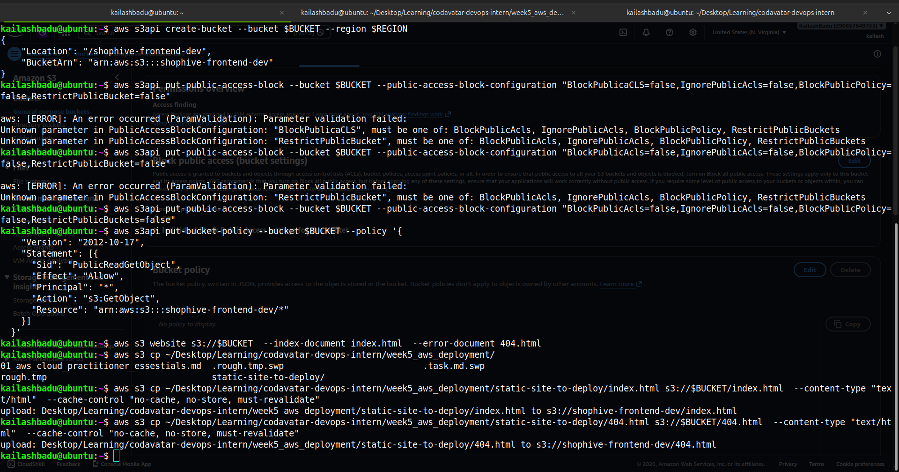
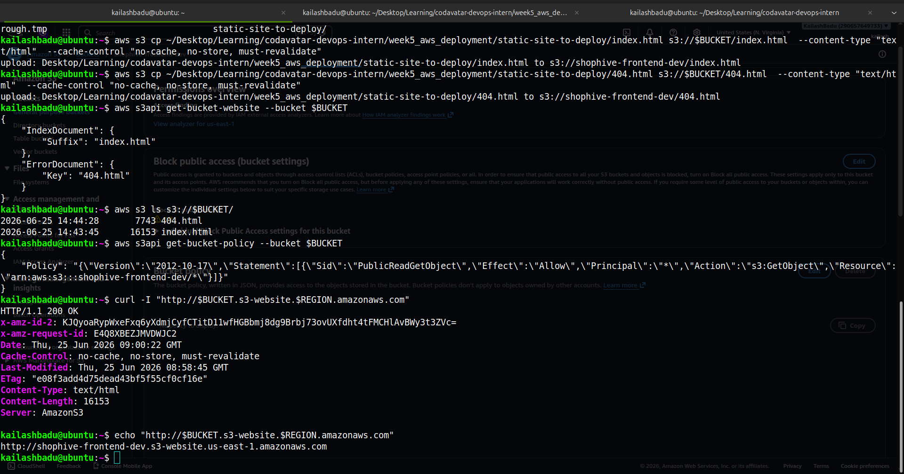

<!-- Screenshot: Viewing site served by s3 -->
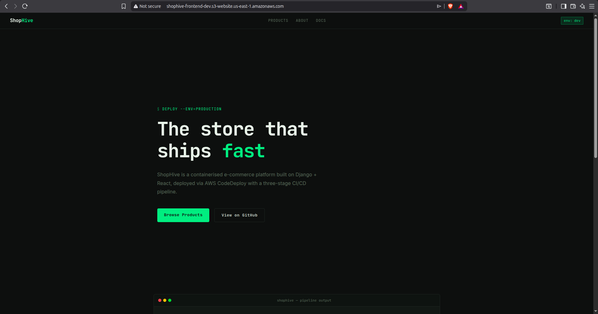
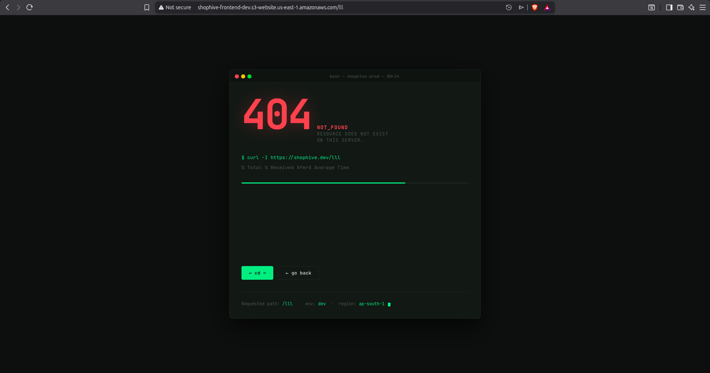

### But This Setup Is Not Production-Ready

Opening S3 directly has three problems:

No HTTPS (http://)  Insecure — browsers warn users, SEO penalize

Block public access is OFF  Your bucket is exposed to the entire internet

Long ugly S3 endpoint URL   Not a real domain name

so we sill use Cloudfront

A CDN (Content Delivery Network) is a globally distributed network of servers (called edge locations) that cache your content close to your users.

Without a CDN, every user — regardless of where they are in the world — fetches files from your single origin server (e.g., S3 in us-east-1). A user in India hitting a US bucket will experience high latency.

Amazon CloudFront is AWS's CDN service. It sits in front of your S3 bucket and:

### steps

<table>
  <tr>
    <td width="50%">
      <strong>1. Set S3 Block Public Access Back ON</strong><br>
      Also remove the public bucket policy if you added one earlier.
    </td>
    <td width="50%">
      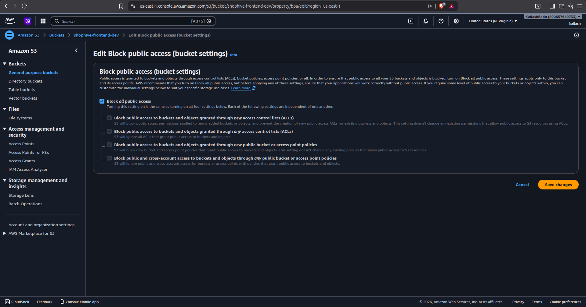
    </td>
  </tr>

  <tr>
    <td width="50%">
      <strong>2. Create a CloudFront Distribution</strong><br>
      Configure the origin.
    </td>
    <td width="50%">
      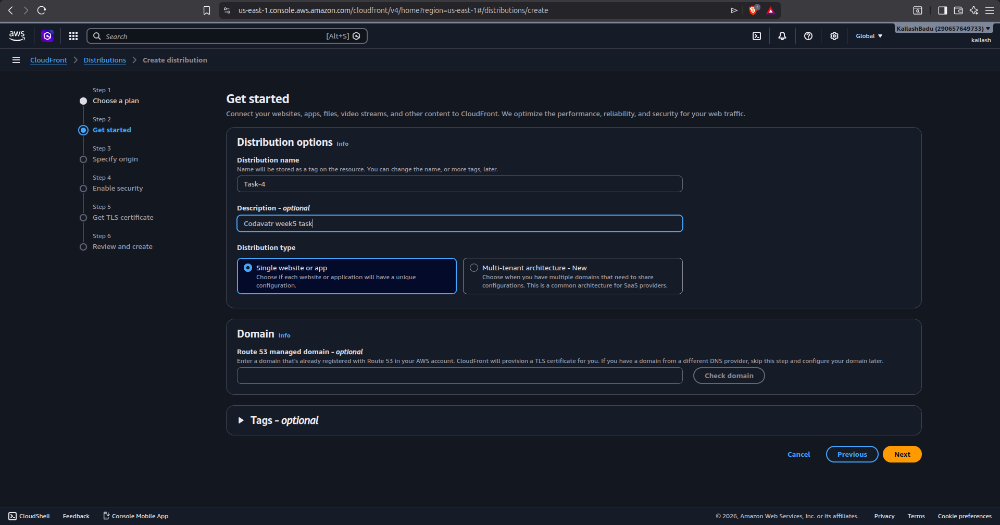
    </td>
  </tr>

  <tr>
    <td width="50%">
      <strong>3. Configure the Origin Access Control (OAC)</strong>
    </td>
    <td width="50%">
      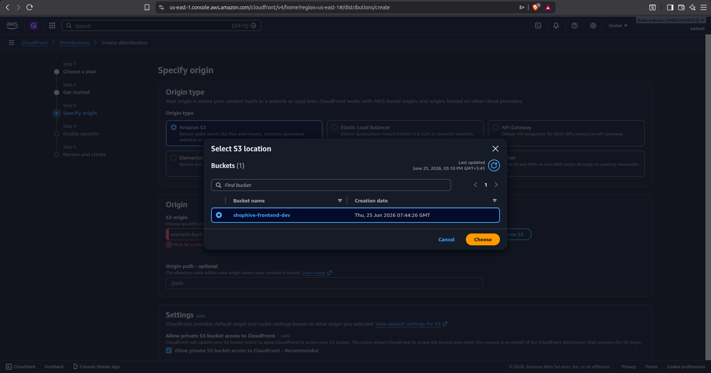
    </td>
  </tr>

  <tr>
    <td width="50%">
      <strong>4. Apply the OAC Bucket Policy</strong>
    </td>
    <td width="50%">
      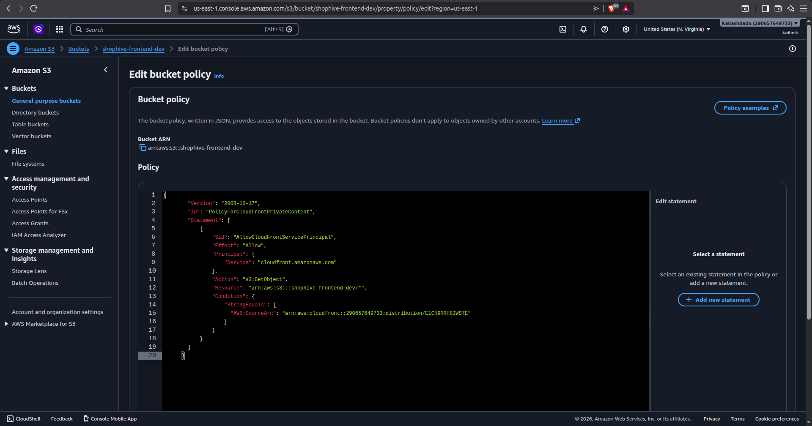
    </td>
  </tr>

  <tr>
    <td width="50%">
      <strong>5. Set Default Root Object</strong><br>
      Set it to <code>index.html</code>.
    </td>
    <td width="50%">
      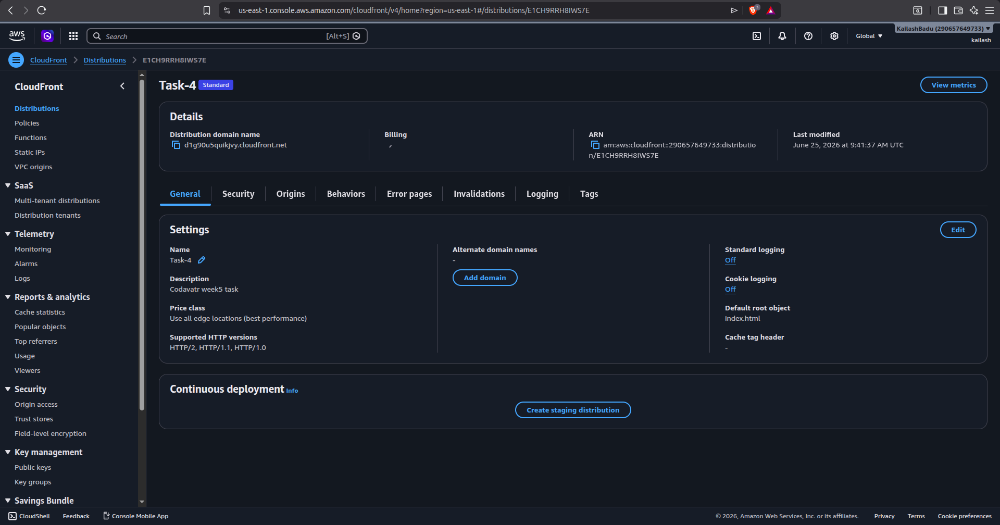
    </td>
  </tr>

  <tr>
    <td width="50%">
      <strong>6. Open the CloudFront URL in your browser</strong><br>
      https://d1g90u5quikjvy.cloudfront.net
    </td>
    <td width="50%">
      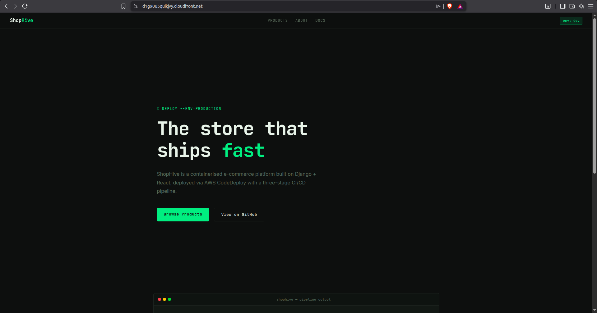
    </td>
  </tr>
</table>

---

## 8. Common Problems and Fixes

| Problem | What Happened | Fix |
|---------|--------------|-----|
| SSH timeout | Port 22 not open in security group, or instance stopped | Check security group inbound rules; verify instance state is "running" |
| `Permission denied (publickey)` | Wrong key file, wrong username, or key not `chmod 400` | Run `chmod 400 devops-key.pem`; confirm username is `ubuntu` for Ubuntu AMIs |
| App not opening in browser | Port 80 blocked or container not running | Check security group for port 80; run `docker ps` to confirm container is up |
| `docker: permission denied` | ubuntu user not in docker group | Run `sudo usermod -aG docker ubuntu` then `newgrp docker` |
| `aws: command not found` | AWS CLI not installed or not in PATH | Re-run install steps; verify with `aws --version` |

---

## Summary

This week tied together Linux, Docker, and cloud into one complete deployment flow. The key takeaway is the separation of concerns — EC2 handles compute, S3 handles storage, security groups handle access control, and Docker handles application packaging. Each piece has one job, and they compose together to form the foundation of cloud-based deployments.


