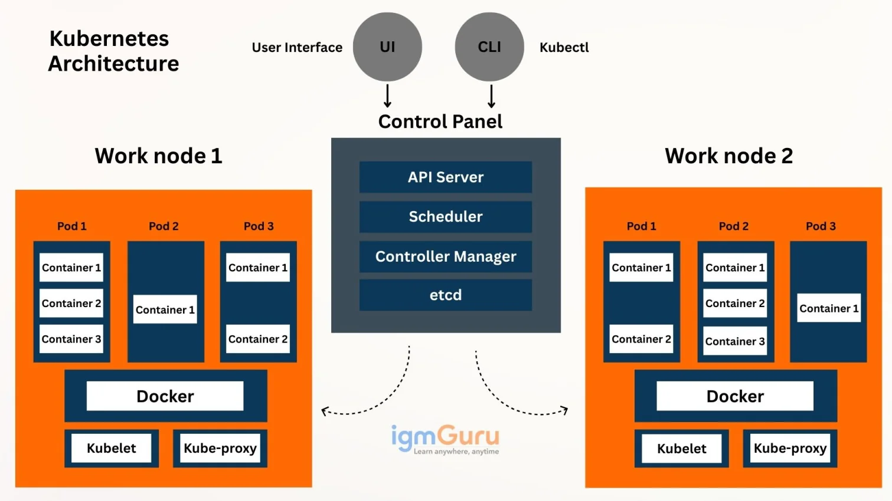

# Kubernetes Introduction

## What is Kubernetes?

Kubernetes (often written as **K8s**) is an open-source **container orchestration platform** originally developed by Google and now maintained by the Cloud Native Computing Foundation (CNCF). It automates the deployment, scaling, and management of containerized applications across a cluster of machines.

The name comes from the Greek word for "helmsman" or "pilot" — the one who steers the ship. The logo is a ship's wheel, which fits: Kubernetes steers your containers across infrastructure.

> If Docker is the shipping container, Kubernetes is the entire port logistics system.

---

## Why Kubernetes? The Problem It Solves

Docker made it easy to package and run one application. But in real production systems, you don't run one container — you run dozens, hundreds, or thousands. With Docker alone, you face a set of problems that grow quickly:

| Problem | What Happens Without Kubernetes |
|---|---|
| A container crashes | You manually restart it |
| Traffic spikes | You manually add more containers |
| You deploy a new version | You manually stop old ones and start new ones |
| A server dies | All containers on it are lost, no automatic recovery |
| You have many services | No built-in way to route traffic between them |
| Secrets and config | You manage them manually per machine |

Kubernetes solves all of these automatically.

---

## Docker vs Kubernetes — What Is the Difference?

This is the most common confusion for beginners. Docker and Kubernetes are **not competitors** — they work together. But they solve different problems.

### Docker: Containerization

Docker is a **containerization tool**. Its job is to:

- Package your application and its dependencies into an **image**
- Run that image as a **container**
- Provide a Dockerfile to define how the image is built
- Allow containers to run in isolation with their own filesystem, network, and processes

Docker operates on a **single machine**. When you run `docker run`, you are starting a container on your local machine or one server. Docker does not know about other machines. It does not restart crashed containers automatically. It does not scale. It does not balance traffic.

### Kubernetes: Orchestration

Kubernetes is an **orchestration platform**. Its job is to:

- Decide **where** containers run across a cluster of machines
- **Restart** containers automatically when they crash
- **Scale** containers up or down based on load
- **Update** running containers without downtime
- **Route traffic** to the right container using services
- **Store configuration and secrets** centrally

Kubernetes does not build images. It uses images that Docker (or another container runtime) has already built.

### Side-by-Side Comparison

| Aspect | Docker | Kubernetes |
|---|---|---|
| Primary purpose | Build and run containers | Manage containers at scale |
| Scope | Single machine | Cluster of many machines |
| Auto-restart on crash | No (unless you add flags) | Yes, built-in |
| Auto-scaling | No | Yes |
| Load balancing | No | Yes |
| Rolling updates | No | Yes |
| Self-healing | No | Yes |
| Secret management | Manual | Built-in with Secrets |
| Typical use | Local development, single server | Production, multi-server, cloud |
| Uses Docker images? | Yes, it builds and runs them | Yes, it runs them (but does not build) |

**The relationship:** Docker builds the container image → Kubernetes runs and manages that image across a cluster.

---

## Containerization vs Orchestration

These are two separate layers of the modern deployment stack.

### Containerization

Containerization is the process of packaging an application and all its runtime dependencies into a **self-contained unit** called a container. The container includes the code, libraries, configuration, and runtime needed to run the application — but shares the host machine's operating system kernel.

Benefits of containerization:
- **Consistency** — runs the same on any machine that has a container runtime
- **Isolation** — one container does not interfere with another
- **Portability** — build once, run anywhere
- **Lightweight** — faster to start than virtual machines because there is no full OS inside

Docker is the most common containerization tool, but there are others like Podman, containerd, and CRI-O.

### Orchestration

Orchestration is the automated management of many containers across many machines. Once you have more than one container or more than one server, you need something to answer questions like:

- Which machine should this container run on?
- What happens if that machine goes offline?
- How do I update all running containers without downtime?
- How do I add five more copies when traffic spikes?

Kubernetes answers all of these questions. It treats your machines as a pool of resources and continuously ensures that the desired state you define (for example, "3 replicas of this container always running") matches the actual state of the cluster.

| Layer | Tool | Question It Answers |
|---|---|---|
| Containerization | Docker, Podman | How do I package and run one application? |
| Orchestration | Kubernetes, Nomad, Swarm | How do I manage many containers across many machines? |

---

## Kubernetes Architecture

Kubernetes follows a **master-worker** architecture. The cluster is divided into two types of nodes:

## What is a Kubernetes Cluster?

A Kubernetes cluster is a set of node machines (physical or virtual) used to run containerized applications. It is logically divided into two main parts: the Control Plane (the brain) and the Data Plane (the workers). 

Control Plane: Makes global decisions about the cluster (e.g., scheduling) and detects/responds to cluster events. 

Data Plane (Worker Nodes): Executes the workloads (containers/pods) assigned by the control plane. 

1. **Self-Managed Clusters (e.g., kubeadm, bare metal)**

In this setup, we provision the machines ourself.

Control Plane: Runs on specific machines designated as "master nodes." These nodes run components like the API Server, Scheduler, and etcd. 

Data Plane: Runs on "worker nodes."

Location: Both planes exist as processes on the VMs/bare-metal servers that you explicitly joined to form the cluster. 


2. Managed Clusters (e.g., GKE, EKS, AKS)

In cloud-managed offerings, the architecture is abstracted:

Control Plane: Often runs in a separate, managed infrastructure owned by the cloud provider (e.g., in a dedicated VPC for EKS).  While logically part of your cluster, you do not see or manage the underlying nodes hosting the control plane.

Data Plane: Runs on the worker nodes (node pools) that you create and manage within your own cloud project/subscription. 

Location: The data plane is clearly "inside" your visible infrastructure. The control plane is "inside" the logical cluster boundary but physically hosted and managed by the cloud provider's backend systems. 


---


**key point to remember**

- API server (kube-apiserver)-> Entry point for all commands
- Scheduler (kube-scheduler) -> decides which node runs what
- Controller Manager (kube-controller-manager) -> watches and maintain state
- etcd (cluster store) -> store all cluster state as key-value

### Control Plane Components

The control plane is the brain of the cluster. It makes global decisions about the cluster and detects/responds to cluster events.

#### API Server (`kube-apiserver`)

The API server is the **front door to Kubernetes**. Every command you run with `kubectl` goes through the API server. It validates requests and updates the state in etcd.

- All communication in the cluster goes through the API server
- It exposes the Kubernetes REST API
- `kubectl` talks to it
- Worker nodes talk to it

#### etcd

etcd is a **distributed key-value store** that stores the entire state of the cluster. Every configuration, every resource definition, every pod status — it all lives in etcd.

- Think of it as the cluster's database
- If etcd is lost, the cluster state is lost
- Always back up etcd in production

#### Scheduler (`kube-scheduler`)

The scheduler watches for newly created pods that have no node assigned and **decides which node they should run on**, based on:

- Available resources (CPU, memory)
- Constraints and policies
- Node labels and taints

#### Controller Manager (`kube-controller-manager`)

The controller manager runs a set of controllers that continuously watch the cluster state and **make the actual state match the desired state**. For example:

- If you say "I want 3 replicas" and one crashes, the ReplicaSet controller creates a new one
- If a node fails, the Node controller marks it and reschedules its pods

### Worker Node Components

Worker nodes are the machines that actually **run your application containers**.

#### kubelet

The kubelet is an agent that runs on every worker node. It:

- Watches the API server for pods assigned to its node
- Instructs the container runtime to start/stop containers
- Reports node and pod status back to the control plane

#### kube-proxy

kube-proxy runs on every node and manages **network rules** that allow communication to pods from inside and outside the cluster.

#### Container Runtime

The actual software that runs containers. Kubernetes supports containerd, CRI-O, and others. Docker can also be used as the container runtime, but containerd is the default in most modern setups.

---

## Core Kubernetes Objects

### Pod

A pod is the **smallest deployable unit** in Kubernetes. It is a wrapper around one or more containers that share the same network namespace and storage volumes.

- Every container in Kubernetes runs inside a pod
- Pods are **ephemeral** — they can be killed and replaced at any time
- Each pod gets its own IP address within the cluster
- If a pod dies, its IP is gone; a new pod gets a new IP

```yaml
apiVersion: v1
kind: Pod
metadata:
  name: my-app-pod
spec:
  containers:
    - name: my-app
      image: nginx:alpine
      ports:
        - containerPort: 80
```

### Deployment

A Deployment manages a set of identical pods (**replicas**). It is the most common way to run applications in Kubernetes.

- Declares the desired state: "I want 3 replicas of this pod always running"
- Handles rolling updates: updates pods one by one with no downtime
- Self-healing: if a pod dies, the Deployment creates a new one automatically
- Rollback: if a bad version is deployed, you can roll back to the previous one

```yaml
apiVersion: apps/v1
kind: Deployment
metadata:
  name: my-app
spec:
  replicas: 3
  selector:
    matchLabels:
      app: my-app
  template:
    metadata:
      labels:
        app: my-app
    spec:
      containers:
        - name: my-app
          image: nginx:alpine
          ports:
            - containerPort: 80
```

### Service

Because pods are ephemeral and their IPs change, a **Service** provides a **stable network endpoint** to access a set of pods. It acts as a load balancer in front of your pods.

Types of Services:

| Type | Description | Use Case |
|---|---|---|
| ClusterIP | Internal IP only, accessible within the cluster | Service-to-service communication |
| NodePort | Exposes the service on a port on every node | Local development, simple external access |
| LoadBalancer | Creates a cloud load balancer | Production on AWS, GCP, Azure |
| ExternalName | Maps to an external DNS name | Accessing external services by name |

```yaml
apiVersion: v1
kind: Service
metadata:
  name: my-app-service
spec:
  type: NodePort
  selector:
    app: my-app
  ports:
    - port: 80
      targetPort: 80
      nodePort: 30080
```

### ConfigMap

A ConfigMap stores **non-sensitive configuration data** as key-value pairs. Applications can read this configuration without needing it baked into the image.

### Secret

A Secret stores **sensitive data** such as passwords, tokens, and keys. Values are base64-encoded (not encrypted by default, but can be encrypted at rest). This keeps credentials out of your application code and Docker images.

### Namespace

Namespaces divide a cluster into **virtual clusters**. They are used to separate environments (dev, staging, production) or teams within the same physical cluster.

---

## Key Kubernetes Features

| Feature | Description |
|---|---|
| **Self-healing** | Automatically restarts failed containers, replaces pods, kills unresponsive ones |
| **Horizontal scaling** | Scale replicas up or down with one command or automatically via HPA |
| **Rolling updates** | Update application versions with zero downtime |
| **Rollback** | Instantly revert to a previous version if something goes wrong |
| **Service discovery** | Pods find each other by service name, not by IP |
| **Load balancing** | Traffic is distributed across healthy pods automatically |
| **Secret and config management** | Separate config and secrets from application code |
| **Storage orchestration** | Automatically mount cloud storage (EBS, GCS) or local storage |
| **Multi-cloud portability** | Same YAML files work on AWS EKS, GCP GKE, Azure AKS, or on-premise |
| **Declarative configuration** | Define desired state in YAML; Kubernetes figures out how to get there |

---

## Declarative vs Imperative

This is an important Kubernetes concept.

**Imperative** means you tell the system *what to do step by step*:
```bash
docker run -d --name web nginx
docker stop web
docker rm web
```

**Declarative** means you describe *what you want the final state to be*, and the system figures out how to achieve it:
```yaml
# deployment.yaml — "I want 3 nginx pods always running"
spec:
  replicas: 3
  ...
```

Kubernetes is primarily declarative. You write YAML manifests describing desired state, apply them with `kubectl apply`, and Kubernetes continuously reconciles the actual state toward the desired state.

---

## Minikube — Local Kubernetes for Learning

Minikube runs a **single-node Kubernetes cluster on your local machine** inside a virtual machine or Docker container. It is designed for learning and local development — not for production.

In a real production cluster, the control plane and worker nodes run on separate machines (usually multiple). Minikube combines everything into one node so you can learn Kubernetes concepts without needing cloud infrastructure.

```bash
# Start a local cluster
minikube start --driver=docker

# Check that the node is ready
kubectl get nodes

# Access a service in the browser
minikube service my-service

# Stop the cluster
minikube stop

# Delete the cluster entirely
minikube delete
```

---

## kubectl — The Kubernetes CLI

`kubectl` is the command-line tool for interacting with any Kubernetes cluster. You use it to create, inspect, update, and delete resources.

### Essential kubectl Commands

```bash
# Cluster information
kubectl cluster-info
kubectl get nodes

# Working with resources
kubectl apply -f manifest.yaml          # Create or update from file
kubectl delete -f manifest.yaml         # Delete from file
kubectl get pods                        # List all pods
kubectl get deployments                 # List all deployments
kubectl get services                    # List all services
kubectl get all                         # List everything

# Inspecting resources
kubectl describe pod <pod-name>         # Detailed info about a pod
kubectl describe deployment <name>      # Detailed info about a deployment
kubectl logs <pod-name>                 # View pod logs
kubectl logs -f <pod-name>             # Follow (tail) logs in real time

# Scaling
kubectl scale deployment <name> --replicas=5

# Executing commands inside a pod
kubectl exec -it <pod-name> -- /bin/sh

# Port forwarding (access a pod locally)
kubectl port-forward pod/<pod-name> 8080:80
```

---

## Summary

| Concept | One-line definition |
|---|---|
| Kubernetes | Platform that automates deployment, scaling, and management of containers |
| Docker | Tool that builds and runs individual containers |
| Containerization | Packaging an app with its dependencies into a portable container |
| Orchestration | Managing many containers across many machines automatically |
| Control Plane | Brain of the cluster — API server, scheduler, controller manager, etcd |
| Worker Node | Machine that runs application containers |
| Pod | Smallest unit — one or more containers running together |
| Deployment | Manages replicas of pods with self-healing and rolling updates |
| Service | Stable network endpoint that routes traffic to pods |
| kubectl | CLI tool to interact with the Kubernetes cluster |
| Minikube | Local single-node Kubernetes cluster for learning |

Kubernetes is the industry standard for running applications at scale. Every major cloud provider — AWS (EKS), Google Cloud (GKE), Azure (AKS) — offers a managed Kubernetes service. Learning Kubernetes locally with Minikube gives you the foundations to work confidently in any of these environments.

# REFERENCES
- https://www.igmguru.com/blog/kubernetes-architecture
