# Week 6: Kubernetes with minikube - Task Documentation

This weeks focuses on container orchestration using kubernetes and minikube

## Task Overview

1. Install Minikube and kubectl
2. Start a local kubernetes cluster
3. Deploy an app using Deployment Yaml
4. Expose the app using service yaml
5. Scale pods form 2 to 3 replicas
6. Check logs and describe resources
7. Document concepts: pods, deployments, services, replicas, NodePort


## Launch an EC2 Instance

Instead of doing this in my local env, i will do it on EC2 instance because i already installed these tools.

## Task 1: Install Kubectl

### Why kubectl

`kubectl` is the command-line interface for kubernetes. Every operation like creating pods, checking logs, scaling depoyments, applying manifests, goes through kubectl, without it, we cannot commnicate with any kubernetes cluster, whether local (minikube) or cloud EKS OR GKE

### How it was done

These commands install the latest stable version of the Kubernetes command-line tool, **kubectl**, on a Linux system. The first command uses `curl` to download the most recent stable release of the `kubectl` binary for the Linux AMD64 architecture by automatically retrieving the latest version number from the Kubernetes release server. The second command installs the downloaded binary into `/usr/local/bin`, sets the owner and group to `root`, and applies executable permissions (`0755`) so that all users can run the command. After the installation is complete, the temporary downloaded file is removed using `rm kubectl` to keep the system clean. Finally, the `kubectl version --client` command verifies that the installation was successful by displaying the installed client version of `kubectl`.

```bash

# Download latest kubectl
curl -LO "https://dl.k8s.io/release/$(curl -L -s https://dl.k8s.io/release/stable.txt)/bin/linux/amd64/kubectl"

# Install it
sudo install -o root -g root -m 0755 kubectl /usr/local/bin/kubectl

# Clean up
rm kubectl

# Verify
kubectl version --client
```

### Screenshots


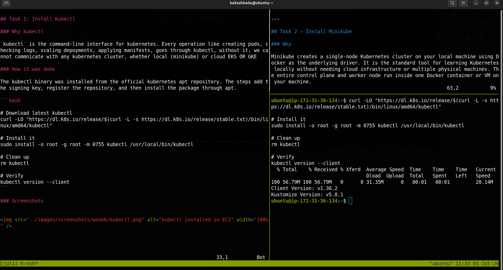


---

## Task2: Install Minikube

### Why

Minikube creates a single node kubernetes cluster on our local machine using Docker as the underlying driver. It is the standard tool for learning kubernetes locally without needing cloud infrestructure or multiple physical machines. The entire control plane and worker node run inside on Docker container or VM on our machine.

### Steps

First install docker.

These commands install and configure **Minikube**, a tool used to run a local Kubernetes cluster for development and testing. The first command downloads the latest Minikube binary for the Linux AMD64 architecture directly from the official GitHub releases page. The second command installs the binary into `/usr/local/bin`, making it available system-wide, and then removes the downloaded file to free up space. Next, the `minikube start` command initializes and starts a local Kubernetes cluster by creating and configuring the necessary virtual environment or container runtime. Finally, the `which minikube` command verifies that Minikube has been installed successfully by displaying the path to the executable, confirming that it is accessible from the system's command line.

```bash
# Download minikube binary
curl -LO https://github.com/kubernetes/minikube/releases/latest/download/minikube-linux-amd64

# Install it globally
sudo install minikube-linux-amd64 /usr/local/bin/minikube && rm minikube-linux-amd64

# Start the cluster
minikube start

# Verify installation
which minikube

```

### Screenshot

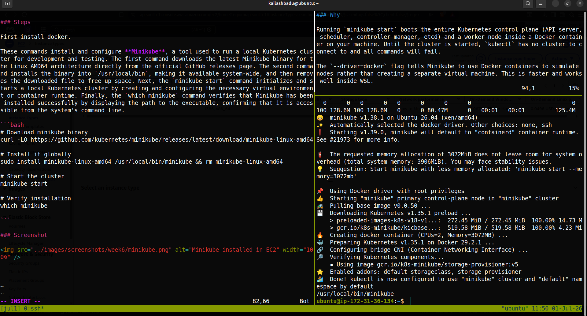


---


## Task 3: Start a Local kubernetes Cluster

### Why

Running minikube start boots the entire kubernetes control plane (API SERVER,Scheduler,controller manager, etcd) and a worker node inside a Docker container on our machine. Until the cluster is started, kubectl has no cluster to connect to and all commands will fail.

The `--driver=docker` flag tells Minikube to use Docker containers to simulate nodes rather than creating a separate virtual machine. This is faster.

### Steps

```bash
minikube start --driver=docker

```
Minikube downloaded the required kubernetes images, started the ontainer, and configured `kubectl` to point to the new local cluster automatically.


### Verification

```bash

kubectl get nodes -o wide

```

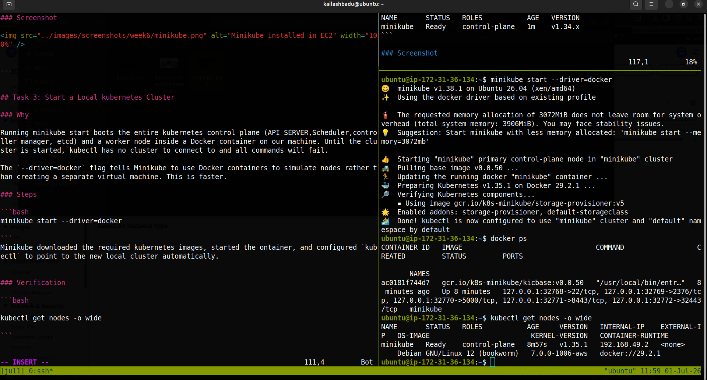


---

## Task 4: Create the working Directory

### Why

Keeping kubernetes manifests orgranized in a dedicated folder make it easy to apply, update, and version-control configurations.All YAML files for this week live in `week6/kubernetes` inside this directory

### Steps

```bash
mkdir -p ~/Desktop/Learning/codavatar-devops-internship/week6_kubernetes/manifests
cd  ~/Desktop/Learning/codavatar-devops-internship/week6_kubernetes/manifests
```

Since im doing this task in my EC2 so i have to copy these manifest file to EC2 using either SCP or rsync

```bash

scp -i ~/Desktop/CREDS/aws/mumbai.pem ~/Desktop/Learning/codavatar-devops-internship/week6_kubernetes/manifests username@13.200.249.50:~/app
```
---

## Task 5: Write and Apply a Deployment Yaml

### Why

A deployment is the standard way to run applications in kubernetes. It does not just start one conntainer - it manages a set of identical pods (replicas) anc continuously ensures the desired number is always running. If a pod crashes, the Deployement controller automatically creates a new one. If we want to update the applicaition, the deployement handles rolling updates one pod at a time with no downtime.

Writing the YAML manually is important because it teaches us what eah field means, rather than just running auto-generated commands.

### Steps

The `deployment.yaml` file was created in the `week6_kubernetes/manifesta/`

`vim deployment.yml
`

```yaml

apiVersion: apps/v1
kind: Deployment
metadata:
  name: devops-cart-app
spec:
  replicas: 3
  selector:
    matchLabels:
      app: devops-cart-app
  template:
    metadata:
      labels:
        app: devops-cart-app
    spec:
      containers:
        - name: devops-cart-app
          image: kailashbadu/devops-cart-app
          ports:
            - containerPort: 3000
          resources:
            requests:
              cpu: "5m"
              memory: "10Mi"
            limits:
              cpu: "30m"
              memory: "30Mi"

```
` kubectl apply -f deploymeny.yml`

### Erros


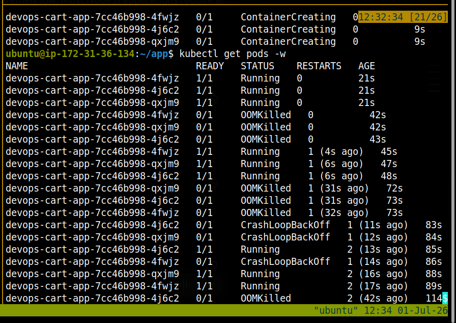


**OOMKilled** means the container was terminated because it exceeded its memory limit.

```yml
resources:
  requests:
    cpu: "5m"
    memory: "10Mi"
  limits:
    cpu: "30m"
    memory: "30Mi"
```

Our container is only allowed 30 MiB of RAM, which is extremely low. Most Node.js applications require at least 100–200 MiB just to start, so the Linux kernel kills the process when it exceeds the limit.

**Verify that memory is the cause** kubectl describe pod devops-cart-app-7cc46b998-4fwjz


**Increase the memory limit**

```yaml
resources:
  requests:
    cpu: "100m"
    memory: "128Mi"
  limits:
    cpu: "500m"
    memory: "256Mi"
```

**Then apply the changes:** `kubectl apply -f deployment.yml` or `kubectl rollout restart deployment devops-cart-app`

```bash
minikube addons enable metrics-server

kubectl top nodes

kubectl top pods
```


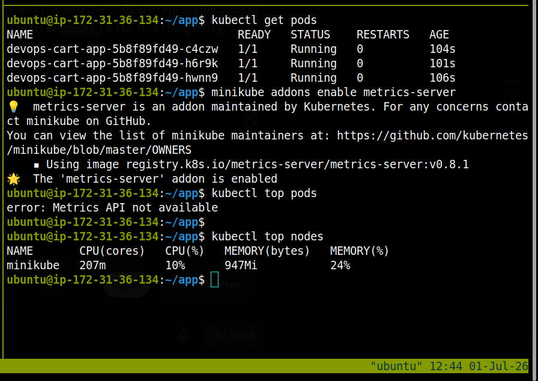


Three pods are running because `replicas:3` was set in thr manifest file.

---

## Task 6: Write and Apply a Service Yaml

### Why

Pods are ephemeral. Every time a pod is created or replaces, it gets a new internal Ip Address. If another service or a browser tried to connect using the pod's IP address directly, the connection would break whenever the pod is replaced.

A service solves  this by giving a stable, permanent endpoint in front of the pods. it acts as a built it load balancer, it routes traffic to any healthy pod that matches the selector label.

NodePort type was choosen beacuse it ecposes the services on a port on the minikube node, making it accessible from outside the cluster during local development.

## Steps

`vim servicce.yml`

```yaml
apiVersion: v1
kind: Service
metadata:
  name: devops-cart-app
spec:
  selector:
    app: devops-cart-app  
  type: NodePort
  ports:
    - protocol: TCP
      port: 3000
      targetPort: 3000
      nodePort: 30080


```
Then apply the manifest: ` kubectl apply -f service.yml`

The service was then open in the browser suing Minikube's build in tunnel.

`minikube service devops-cart-app`

This is oK when in my local machine but it is not sufficient in EC2. So we need to forward the port.

The reason minikube service devops-cart-app is not enough to access your site from your local browser through EC2 is because of how Minikube networking works.

when i ran `minikube service devops-cart-app` minikube gives me a URL link http://192.168.49.2:30080

Here: 192.168.49.2 is the Minikube node IP, 30080 is the NodePort

The address exists inside the EC2 machine's Minikube network

The traffic path looks like this:

```bash

Your Laptop Browser
        |
        | cannot reach
        |
EC2 Public IP (13.200.249.50)
        |
        |
Minikube VM Network
        |
        |
192.168.49.2:30080
        |
        |
Kubernetes Service
        |
        |
Next.js Pod

``` 

My  laptop cannot directly access: `192.168.49.2:30080`

because 192.168.x.x is a private internal network address. It is not routable over the internet.

**Why port forwarding works**

```bash

kubectl port-forward --address 0.0.0.0 service/devops-cart-app 3000:3000

```
Kubernetes creates a listener on the EC2 host: EC2 Public IP:3000

and forwards traffic internally:

```bash

Your Laptop
     |
     |
13.200.249.50:3000
     |
     |
EC2 Ubuntu
     |
     |
kubectl port-forward
     |
     |
Kubernetes Service
     |
     |
Next.js Pod
```

---

### Next.js Kubernetes Port Forwarding Issue and Resolution

***Problem Description***

The Next.js application was deployed successfully on Kubernetes using Minikube. The pods were running, the Service was created, and the application was accessible internally through the Minikube NodePort.

However, when trying to access the application externally using `kubectl port-forward`, the connection failed.

The errors received were:

```
curl: (52) Empty reply from server
```

and during port forwarding:

```
error forwarding port 3000 to pod:
socat E connect(5, AF=2 127.0.0.1:3000): Connection refused
```

The application was accessible through:

```
http://192.168.49.2:30080
```

but not through:

```
http://localhost:3000
```

or:

```
http://EC2_PUBLIC_IP:3000
```

**Root Cause**

The issue was caused by the Next.js application not listening on all network interfaces.

Inside the container, the listening ports were checked using:

```bash
netstat -tlnp
```

The output showed:

```
tcp 0 0 10.244.0.8:3000 0.0.0.0:* LISTEN 1/next-server
```

The application was listening only on the Kubernetes pod IP:

```
10.244.x.x:3000
```

instead of:

```
0.0.0.0:3000
```

Because the application was not bound to all interfaces, Kubernetes port forwarding could not correctly route traffic to the Next.js server.

### Troubleshooting Steps

#### 1. Checked Pod Status

Verified that the Kubernetes pods were running:

```bash
kubectl get pods
```

Output:

```
NAME                               READY   STATUS
devops-cart-app-xxxxx              1/1     Running
```

The containers were healthy.

#### 2. Checked Kubernetes Service

Verified the Service configuration:

```bash
kubectl get svc devops-cart-app
```

Output:

```
NAME              TYPE       PORT(S)
devops-cart-app   NodePort   3000:30080/TCP
```

The Service was correctly exposing port 3000.


#### 3. Checked Service Endpoints

Verified that the Service was connected to the pods:

```bash
kubectl get endpoints devops-cart-app
```

Output:

```
devops-cart-app
10.244.0.7:3000
10.244.0.8:3000
10.244.0.9:3000
```

This confirmed that Kubernetes networking and Service selectors were working.


### 4. Checked Application Logs

Checked the application logs:

```bash
kubectl logs -l app=devops-cart-app
```

The logs showed:

```
Next.js 15.5.18

Local:   http://container-name:3000
Network: http://container-name:3000

Ready
```

The application started successfully.

#### 5. Tested Port Forwarding

Started port forwarding:

```bash
kubectl port-forward --address 0.0.0.0 service/devops-cart-app 3000:3000
```

The port opened successfully:

```
Forwarding from 0.0.0.0:3000 -> 3000
```

However, requests failed because the application was not accepting connections through the forwarded interface.

#### 6. Checked Application Binding

Accessed the container:

```bash
kubectl exec -it <pod-name> -- sh
```

Checked listening ports:

```bash
netstat -tlnp
```

Found:

```
10.244.0.8:3000 LISTEN
```

The application was not binding to:

```
0.0.0.0:3000
```

#### Solution

Instead of modifying `package.json`, the Kubernetes deployment was updated with an environment variable.

Added:

```yaml
env:
  - name: HOSTNAME
    value: "0.0.0.0"
```

Deployment example:

```yaml
containers:
  - name: devops-cart-app
    image: kailashbadu/devops-cart-app
    ports:
      - containerPort: 3000
    env:
      - name: HOSTNAME
        value: "0.0.0.0"
```

#### Apply Changes

Applied the updated deployment:

```bash
kubectl apply -f deployment.yml
```

Restarted the deployment:

```bash
kubectl rollout restart deployment devops-cart-app
```

Checked the pods:

```bash
kubectl get pods
```

All pods returned:

```
READY   STATUS
3/3     Running
```

---

#### Verification

Checked the application listening address:

```bash
netstat -tlnp
```

The application was now listening correctly:

```
0.0.0.0:3000
```

Started port forwarding:

```bash
kubectl port-forward --address 0.0.0.0 service/devops-cart-app 3000:3000
```

The application became accessible through:

```
http://EC2_PUBLIC_IP:3000
```

### Conclusion

The issue was not caused by Kubernetes Pods, Services, or Networking.

The root cause was the Next.js application binding to the pod IP address instead of listening on all available interfaces.

By configuring the application to listen on `0.0.0.0`, Kubernetes port forwarding worked correctly and the application became accessible externally.


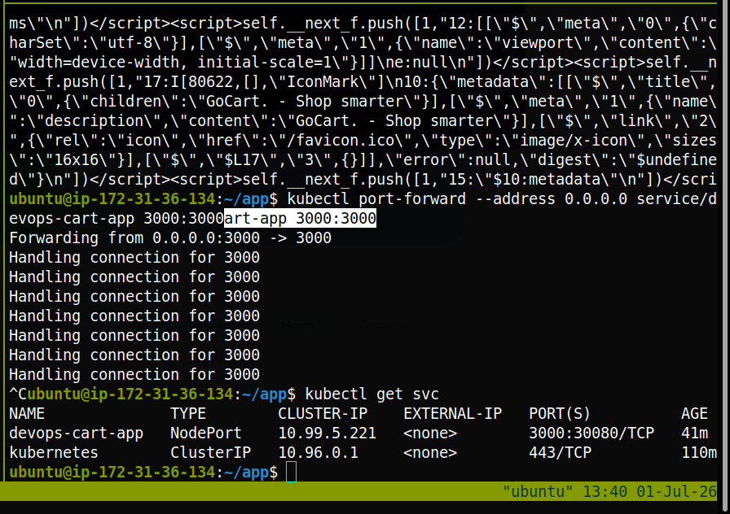
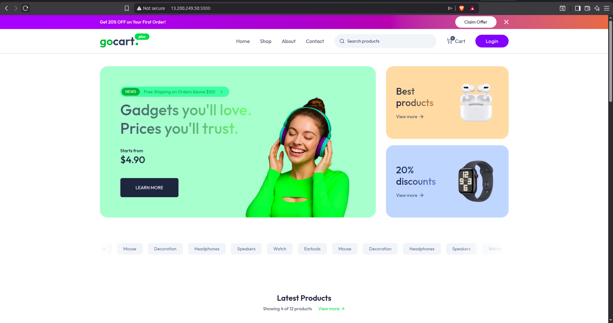


---

## Task 7: Scale Pods from 3 to 4 Replicas

### Why

One of the core benefits of Kubernetes is horizontal scaling  adding more pods to handle increased traffic or load. This can be done manually with `kubectl scale` or automatically with Horizontal Pod Autoscaler (HPA). Practicing manual scaling helps understand how Kubernetes reacts when the desired replica count changes.

When the replica count is increased, the Deployment controller detects the difference between desired state (4) and actual state (3) and immediately creates a new pod on an available node.

### How It Was Done

```bash
kubectl scale deployment devops-cart-app --replicas=4
```

### Verification

```bash
kubectl get pods
```

The fourth pod appears within seconds. Kubernetes scheduled it automatically.

Verify the deployment also reflects the updated count:

```bash
kubectl get deployments
```
### Screenshot

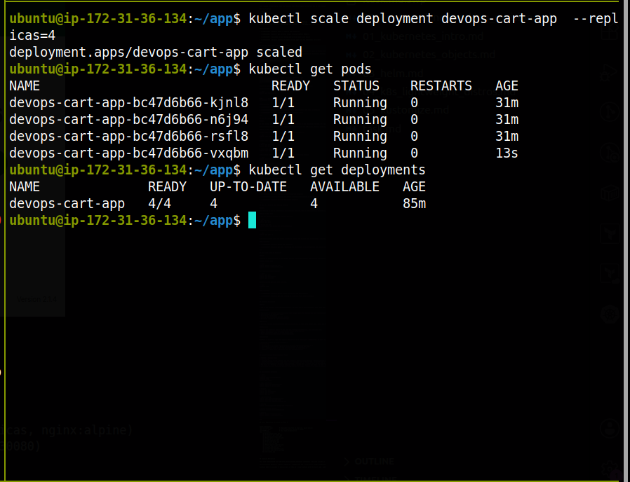

---

## Task 8: Check Logs and Describe Resources

### Why

In real DevOps work, checking logs and describing resources is how we debug problems. If a pod is crashing, `kubectl logs` shows the application error. If a pod is stuck in `Pending`, `kubectl describe pod` shows scheduling events that explain why such as insufficient CPU or a missing image.

Understanding these commands is as important as understanding the YAML files, because production issues are solved by reading logs and events, not by guessing.

### How It Was Done

**Check logs from the Deployment (aggregated across all pods):**

```bash
kubectl logs deployment/devops-cart-app
```

**Check logs from a specific pod:**

```bash
# First get pod names
kubectl get pods

# Then check logs for one pod
kubectl logs devops-cart-app-bc47d6b66-kjnl8
```

**Describe a pod to see events, resource usage, and scheduling info:**

```bash
kubectl describe pod devops-cart-app-bc47d6b66-kjnl8
```

The `describe` output includes:
- Which node the pod is running on
- Container image and ports
- Resource limits and requests
- Volume mounts
- Conditions (Initialized, Ready, ContainersReady)
- Events (pulled image, created container, started)

**Describe the deployment:**

```bash
kubectl describe deployment devops-web
```

**Describe the service:**

```bash
kubectl describe service devops-web-service
```

### Screenshot

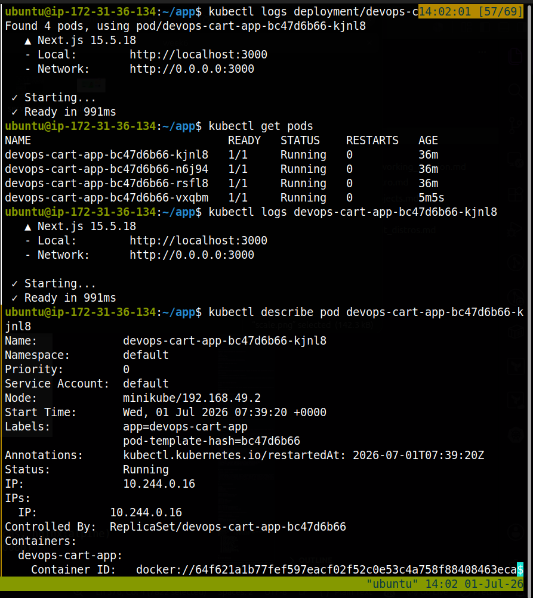
---

## Task 9: Observe Self-Healing Behavior

### Why

Self-healing is one of Kubernetes's most powerful features. When a pod is manually deleted (simulating a crash), the Deployment controller detects that the actual number of running pods (3) no longer matches the desired number (4) and immediately creates a replacement. This demonstrates the core reconciliation loop that Kubernetes runs continuously.

### How It Was Done

A pod was manually deleted to simulate a crash:

```bash
# Get pod name
kubectl get pods

# Delete one pod
kubectl delete pod devops-cart-app-bc47d6b66-kjnl8
```

Immediately watch the pods list:

```bash
kubectl get pods -w
```

Kubernetes creates a new pod within seconds to replace the deleted one, maintaining 4 replicas.

### Screenshot


---
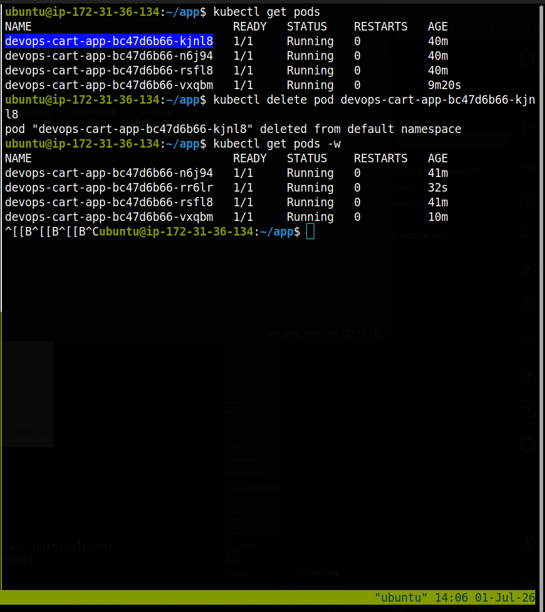

## Task 10: Clean Up Resources

### Why

Cleaning up after practice is good DevOps hygiene. Unused deployments and services consume cluster resources. In a cloud environment, they can also incur costs. The `kubectl delete` commands remove the resources from the cluster without deleting the YAML files — so the same configuration can be re-applied later.

### How It Was Done

```bash
kubectl delete -f service.yml
kubectl delete -f deployment.yaml
```

Verify everything is removed:

```bash
kubectl get pods
kubectl get deployments
kubectl get services
```

Stop Minikube when finished:

```bash
minikube stop
```

### Screenshot

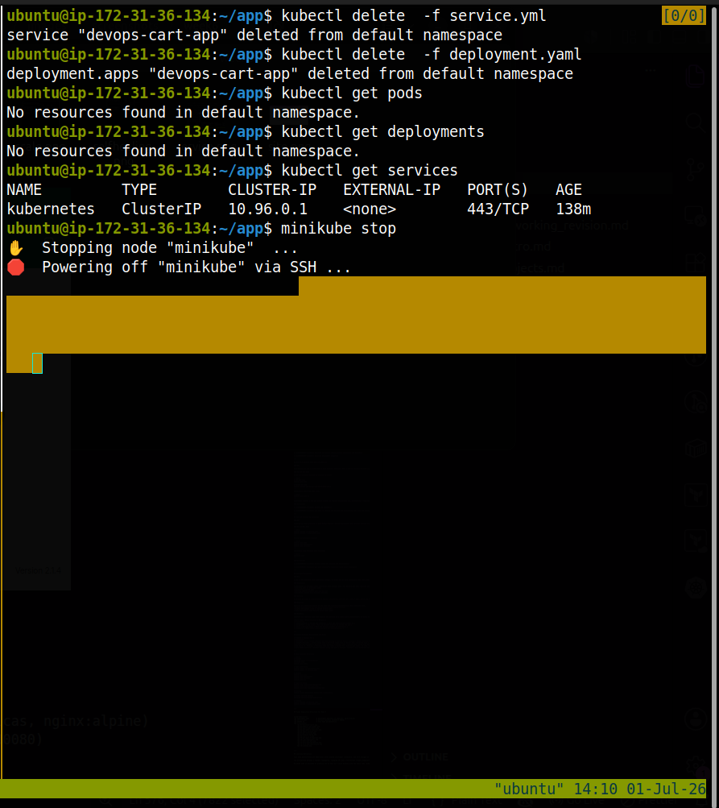
---

## Concepts Documented

### Pod

A pod is the smallest unit Kubernetes manages. It wraps one or more containers that share the same network and storage. Pods are **ephemeral** — they can be terminated and recreated at any time. Each pod gets a cluster-internal IP that changes every time the pod is replaced.

### Deployment

A Deployment is a higher-level controller that manages pods. You declare how many replicas you want, and the Deployment ensures that many pods are always running. It handles:
- Starting pods on available nodes
- Restarting crashed pods
- Rolling updates (update pods one by one)
- Rollbacks (revert to a previous version)

### Service

A Service provides a stable network address (ClusterIP) in front of a set of pods. Since pod IPs change, clients always connect to the Service IP, which routes to healthy pods. NodePort extends this by exposing the Service on an external port on every node.

### Replicas

Replicas are identical copies of the same pod running simultaneously. More replicas mean:
- Higher availability (if one pod crashes, others serve traffic)
- Higher throughput (load is spread across pods)
- Fault tolerance (node failure loses fewer pods)

### NodePort

NodePort is a Service type that exposes the Service on a static port (30000–32767) on every node in the cluster. In Minikube, `minikube service <name>` finds the node IP automatically and constructs the access URL.

| Port Type | Where It Lives | Purpose |
|---|---|---|
| `containerPort` | Inside the container | Port the application listens on |
| `targetPort` | Pod level | Port to forward traffic to inside the pod |
| `port` | Service level | Port the Service listens on internally |
| `nodePort` | Node level | External port for outside access |

---

## Common Problems Encountered and Fixes

| Problem | Cause | Fix |
|---|---|---|
| `minikube start` failed | Docker was not running | Started Docker Desktop / Docker service first |
| `ImagePullBackOff` | Wrong image name | Verified image name on Docker Hub, corrected typo |
| Service not reachable | Selector label mismatch | Checked that `selector.app` in Service matches `labels.app` in Deployment |
| Pod stuck in `Pending` | Minikube node not ready | Waited for `kubectl get nodes` to show `Ready` |
| Port 30080 conflict | Another process using the port | Changed `nodePort` to a different value in service.yaml |

---

## Key Commands Reference

```bash
# Cluster
minikube start --driver=docker
minikube stop
kubectl get nodes

# Apply manifests
kubectl apply -f deployment.yaml
kubectl apply -f service.yaml

# Inspect
kubectl get pods
kubectl get deployments
kubectl get services
kubectl get all

# Logs and debug
kubectl logs deployment/devops-web
kubectl describe pod <pod-name>
kubectl describe deployment devops-web

# Scaling
kubectl scale deployment devops-web --replicas=3

# Access service locally
minikube service devops-web-service

# Cleanup
kubectl delete -f service.yaml
kubectl delete -f deployment.yaml
```

